# Planet Engine World Generation: Final Architecture and Implementation Roadmap

## Current status

This document is the forward implementation contract for Planet Engine world generation after the merged WG-3 continental-morphology work.

As of 2026-09-14, `main` includes merged PR #48, `feat(worldgen): rework continental macro morphology`, at merge commit `3fc9a9e42042703c4f182646208e71b9c66ab7d9`.

Current accepted generation identity:

- engine version: **12**;
- protocol version: **18**;
- WG-3 geology/continental assembly: **stage v3**;
- current canonical implemented physical chain ends at **WG-7D lake sediment infill**;
- WG-3 v3 is now the accepted upstream continental baseline, not future roadmap work.

The remaining roadmap starts with reusable hydrostatic water infrastructure and WG-4 tectonic/topographic refinement, then proceeds through lithology, landscape maturation, mobile shorelines, final climate/hydrology rebinds, ecology, resources, and derived geography.

---

## Previous Agent

This section records the work completed immediately before this roadmap update so that a new agent can continue without repeating the same repository investigation and calibration cycle.

### PR #47 — continental morphology observability

PR #47 was merged before changing WG-3 generation. Its purpose was to make continental morphology measurable instead of relying on screenshots alone.

It added deterministic diagnostics for:

- significant continental component count;
- component area hierarchy and coefficient of variation;
- largest-to-median area ratio;
- elongation;
- compactness;
- multi-plate continental components;
- satellite component count and area fraction;
- secondary-component complement metrics;
- constricted/bottleneck sample fraction;
- fine/medium/coarse boundary-complexity diagnostics;
- tectonic-layout coupling.

The key baseline lesson was that the old generator had too much short-range outline complexity and too many narrow/satellite features relative to its large-scale continental structure.

### PR #48 — WG-3 v3 continental macro morphology

PR #48 was merged and is now the current WG-3 implementation.

WG-3 v3 separates **continent-scale assembly** from **margin-scale detail**.

The implemented model now:

- builds a broad macro continental affinity from anisotropic continental nuclei, tectonic relationships, broad structural fabric, boundary bias, and deterministic broad assembly corridors;
- allows assembly corridors only for compatible same-plate or convergent relationships;
- does not artificially bridge divergent or unrelated continental domains;
- limits the short-range structural field to bounded bands near provisional continental/transitional margins instead of allowing it to influence the whole global threshold field;
- re-solves exact area-weighted continental/transitional thresholds after bounded margin detail;
- preserves multi-plate continental assembly and the existing tectonic-coupling contract;
- advances WG-3 geology identity to v3 and engine identity to v12 while leaving protocol v18 unchanged.

The six-seed L4 directional result from the #47 baseline to WG-3 v3 was approximately:

| Metric | #47 baseline | WG-3 v3 |
|---|---:|---:|
| mean satellite area fraction | 0.0023 | 0.0012 |
| mean constricted sample fraction | 0.0207 | 0.0137 |
| fine complexity | 10.958 | 8.158 |
| medium complexity | 10.078 | 7.544 |
| coarse complexity | 9.577 | 7.222 |
| tectonic-layout changed fraction | 0.6085 | 0.6202 |

The accepted WG-3 morphology gates include:

- mean satellite area fraction `<= 0.0018`;
- mean constricted sample fraction `<= 0.0175`;
- mean coarse complexity `>= 6.0`;
- the existing hierarchy, elongation, non-compactness, multi-plate, CV, and tectonic-coupling gates.

Fine/medium complexity remains diagnostic rather than a direct minimization target. The goal is not to make smooth blobs; it is to move shape complexity from arbitrary short-range edge noise into coherent macrostructure.

### Downstream compatibility issues exposed by PR #48

The WG-3 change exposed two pre-existing/latent downstream issues during full-pipeline validation.

**WG-6D seasonal lake convergence.** The seasonal lake spinup previously allowed termination when either relative-volume convergence or lake-surface convergence was satisfied. It now requires both. This preserves the existing surface-level tolerance and prevents a physically incomplete seasonal lake cycle from being accepted merely because volume stabilized first.

**WG-7D sediment diagnostic precision.** The lake-sediment benchmark now prints enough numerical precision for its existing conservation check, avoiding false failures caused by diagnostic output rounding rather than physical non-closure.

The WG-4 continental-rift acceptance envelope was also recalibrated from a 25% to 24% lower bound for the new deterministic WG-3 ensemble. The new aggregate result was about 24.48%. Deep-rift and transitional-rift acceptance limits were not weakened.

The committed browser WASM package was rebuilt with the pinned Rust `1.98.1` and wasm-bindgen `0.2.127` toolchain. Final Planet Engine Tests and WASM parity were green on the clean PR head before merge.

### Current accepted `interlink-wg7c` evidence

The post-merge GitHub Pages calibration packet for `interlink-wg7c` at **L6 → L8**, **16 plates**, **655,362 samples**, **engine v12** reports:

| Metric | Current value |
|---|---:|
| significant continental components | 4 |
| component area CV | 1.086 |
| largest/median area ratio | 13.620× |
| max elongation | 1.612 |
| max compactness | 23.056 |
| largest component plate count | 9 |
| major multi-plate component | true |
| land/ocean | 38.8% / 61.2% |
| mean land elevation | ~1357 m |

Significant continental component areas are approximately 143.4M, 46.1M, 10.5M, and 4.6M km².

Visual review of the same seed in physical elevation/bathymetry and crust-age views with fine tectonic boundaries was accepted for PR #48. The dominant continent reads as a broad, coherent multi-plate landmass rather than several tiny regions linked by pixel-scale bridges. Multiple tectonic boundaries cross continental interiors, and the margins show broad embayments/lobes without the previous shredded-edge failure mode dominating the silhouette.

The same packet reports seasonal hydrology reaching the 24-year spinup cap with final lake-surface cycle change around `0.0162 m`. Some post-#48 runs may therefore be materially slower because the corrected WG-6D convergence test performs more legitimate spinup work. A persistent major runtime regression should be profiled, but the convergence requirement should not be weakened merely to recover the old timing.

### Calibration-packet caveat

The current GitHub Pages packet is still an approximate transport/diagnostic product:

- continental component areas use equal-sample area rather than canonical dual-cell area;
- derived topography means/percentiles are unweighted sample summaries;
- protocol v18 does not transport the complete per-lake gross inflow/evaporation budget.

Use this packet for deterministic regression and directional comparison. Do not treat every absolute area/budget value as canonical physical truth.

### What not to reopen immediately

Do **not** start another WG-3 shape-tuning PR just because the current world still has large basins, lakes, depressions, or non-final coastlines. Those are downstream concerns.

Do **not** tune WG-5/WG-6 around the current intermediate geography merely to make WG-7D look like a final mature Earth-like world. The roadmap intentionally makes WG-5 and WG-6 initial forcing states and adds final climate/hydrology rebinds later.

Do **not** return to palette-driven fixes. Rendering should diagnose physical state; it should not disguise immature physical generation.

---

## Recommended steps for next agent

The next agent should continue from the merged WG-3 v3 baseline in the following order.

### 1. Extract the reusable hydrostatic surface-water solver

This is the **immediate next physical PR**.

WG-4 already contains the necessary private water-volume/sea-level solve. Extract it into a reusable public physical primitive, proposed as `rust/interlink-worldgen/src/surface_water.rs`, without intentionally changing WG-4 output.

Required behavior:

- solve sea level from solid elevation, canonical physical cell area, planet radius, and total water inventory;
- output elevation-above-sea-level, water depth, submerged mask, solved sea level, target/solved water volume, and closure error;
- deterministic tie handling;
- zero-water planets remain dry;
- increasing water inventory does not lower sea level;
- a constant vertical offset of the entire solid surface translates solved sea level by the same offset while preserving equivalent water depths/mask;
- passing the existing WG-4 surface and planet parameters through the extracted primitive reproduces accepted WG-4 water state bit-for-bit where practical, otherwise within a narrowly documented numerical tolerance.

This PR should be a refactor, not a morphology change. Do not combine it with WG-4 relief tuning. If physical output is unchanged, avoid a semantic WG-4 version bump simply for code movement.

### 2. Rework WG-4 tectonic relief and initial-ocean geometry

After the hydrostatic primitive is safely extracted, begin WG-4 vNext.

Use direct component diagnostics to determine whether the remaining large-scale issues come from:

- ridge width/continuity;
- trench width/depth response;
- volcanic-arc geometry;
- continental-rift morphology;
- inherited orogenic width/shape;
- boundary-distance kernels;
- broad ocean-basin depth structure;
- deep-ocean contour angularity;
- over-broad or overly piecewise tectonic response fields.

Prefer causal response-kernel changes over arbitrary coastline noise or rendering tricks.

If the current diagnostics cannot distinguish these failure modes, add observability before broad parameter tuning. Use fixed calibration seeds plus holdout seeds; do not optimize against a single screenshot.

### 3. Add WG-4.5 lithology/substrate

Once WG-4 vNext is stable, add a deterministic, initially observable substrate state before changing erosion.

The first lithology PR should primarily establish state, provenance, diagnostics, and contracts. It should not immediately rewrite WG-7 behavior.

Recommended continuous fields include:

- rock strength;
- erodibility;
- permeability;
- weathering susceptibility;
- fines/sediment-character proxy;
- optional carbonate or compositional proxy.

A categorical bedrock class can exist for provenance and diagnostics, but downstream physics should consume continuous material properties.

### 4. Make WG-7A/B lithology-aware

Only after WG-4.5 is accepted should erosion and terrain evolution consume substrate properties.

Preserve the existing sediment ledger and conservation meaning. Add controlled tests where identical slope/discharge over weaker substrate erodes more than stronger substrate.

### 5. Continue the remaining mature-world sequence

After the stages above, continue in dependency order:

`WG-7E hillslope maturation → WG-7F glacial geomorphology → WG-7G provisional shoreline/outlets → WG-7H coastal sedimentation/deltas → WG-7I final hydrostatic shoreline → WG-8A final climate rebind → WG-8B final hydrology rebind → WG-9 soil/ecology/vegetation/biomes → WG-10 resources/derived geography`.

Do not combine adjacent high-risk physical stages into one PR.

---

## Executive summary

Planet Engine already has the right high-level architecture: deterministic spherical topology, tectonics, crustal history, lithospheric mechanics, multiresolution inheritance, initial topography, climate, hydrology, fluvial erosion, terrain evolution, hydrologic reconciliation, and lake-sediment infill are separated into explicit Rust stages with state identities, metrics, tests, and browser/WASM transport.

The project should **not** be replaced by a monolithic terrain generator.

The central architectural problem is that the current pipeline freezes an **initial geophysical world** too early:

- WG-4 sea level/ocean mask remain fixed through the current WG-7D endpoint;
- WG-5 climate is solved against WG-4 geography and is not rebound after mature terrain/coastline changes;
- WG-7A/B generate and route sediment, but terminal/ocean sediment is not yet used to construct deltas/coastal terrain;
- lithology is still missing even though erosion, glaciers, soil, permeability, and resources depend on substrate;
- hillslope evolution, glacial erosion, coastline migration, weathering/regolith/soil, ecology, vegetation, and biomes remain outside the implemented chain.

The correct destination remains:

**initial topography → lithology → initial climate → initial hydrology → erosion/sediment → hillslope/glacial/coastal maturation → final shoreline → final climate → final hydrology → soil/ecology/vegetation/biomes → resources/derived geography**.

This uses a deliberately bounded two-pass environmental design rather than an open-ended climate↔erosion↔coast feedback loop.

---

## Final target architecture

```mermaid
flowchart TD
    P["Planetary parameters"] --> W1["WG-1<br/>Canonical spherical topology"]
    W1 --> W2["WG-2<br/>Macro tectonics"]
    W2 --> W3["WG-3 v3<br/>Crust + geological assembly<br/>(implemented)"]
    W3 --> W35["WG-3.5<br/>Lithospheric mechanics"]
    W35 --> W375["WG-3.75<br/>Multiresolution inheritance"]
    W375 --> W4["WG-4 vNext<br/>Initial tectonic topography + initial ocean"]
    W4 --> W45["WG-4.5<br/>Lithology + substrate"]

    W45 --> W5["WG-5<br/>Initial climatology"]
    W5 --> W6["WG-6A-D<br/>Initial hydrology"]
    W6 --> W7A["WG-7A vNext<br/>Lithology-aware fluvial erosion + sediment"]
    W7A --> W7B["WG-7B vNext<br/>Terrain evolution"]
    W7B --> W7C["WG-7C<br/>Intermediate hydrology reconciliation"]
    W7C --> W7D["WG-7D<br/>Lake sediment infill"]

    W7D --> W7E["WG-7E<br/>Hillslope maturation"]
    W7E --> W7F["WG-7F<br/>Glacial geomorphology"]
    W7F --> W7G["WG-7G<br/>Provisional shoreline + outlet reconciliation"]
    W7G --> W7H["WG-7H<br/>Coastal sedimentation + deltas"]
    W7H --> W7I["WG-7I<br/>Final hydrostatic shoreline"]

    W7I --> W8A["WG-8A<br/>Final climate rebind"]
    W8A --> W8B["WG-8B<br/>Final hydrology rebind"]

    W8B --> W9A["WG-9A<br/>Regolith + soil"]
    W9A --> W9B["WG-9B<br/>Ecological substrate"]
    W9B --> W9C["WG-9C<br/>Vegetation / PFT equilibrium"]
    W9C --> W9D["WG-9D<br/>Derived biomes"]

    W9D --> W10A["WG-10A<br/>Resource geology"]
    W10A --> W10B["WG-10B<br/>Derived geography"]
```



The semantic authority model is:

```text
INITIAL SURFACE
     ↓
initial ocean → initial climate → initial hydrology
                                  ↓
                        geomorphic maturation
                                  ↓
                             FINAL SURFACE
                                  ↓
                  final ocean → final climate
                                  ↓
                         final hydrology
                                  ↓
                      soil → ecology → biome
```

The second climate/hydrology solve is a one-time final reconciliation, not an iterative Earth-system loop.

---

## Current pipeline and roadmap treatment

| Stage | Current physical role | Roadmap treatment |
|---|---|---|
| **WG-1** | Hierarchical geodesic topology and finite-volume geometry. | **Keep.** Shared substrate for all later graph/finite-volume processes. |
| **WG-2** | Plate partition, rigid motion, boundary kinematics. | **Keep.** Improve only when tectonic calibration requires it; plate boundaries are not coastline templates. |
| **WG-3 v3** | Continental/oceanic/transitional crust, province assembly, inferred history, spreading age, boundary geological regimes. | **Current accepted baseline.** Macro rework merged in #48. Revisit only with reproducible ensemble evidence. |
| **WG-3.5** | Strength, weakness, elastic thickness, structural fabric, mantle support, selective kinematic refinement. | **Keep.** Feed more strongly into lithology/geomorphology later. |
| **WG-3.75** | Deterministic coarse→fine physical inheritance and fine boundary provenance. | **Keep.** Important performance/causality boundary. |
| **WG-4** | Isostasy/tectonic relief, bathymetry, solid elevation, initial sea level/water depth/submerged mask. | **Keep as initial topography/ocean; rework response geometry.** Extract hydrostatic solve first. |
| **WG-5** | Reduced coupled climatology: insolation, temperature, circulation, SST, moisture, precipitation, PET/aridity, snow/ice potential. | **Keep as initial climate forcing.** Reuse kernel once later for final climate. |
| **WG-6A-D** | Drainage, runoff, lakes, realized discharge, seasonal hydrology. | **Keep as initial hydrology.** Reuse kernels later for final hydrology. |
| **WG-7A** | Fluvial erosion, sediment production/routing/deposition. | **Upgrade later to consume lithology.** Preserve conservative ledger. |
| **WG-7B** | Bounded terrain evolution and rebuilt drainage. | **Keep and make substrate-aware.** Current coastline remains initial/intermediate. |
| **WG-7C** | Post-erosion hydrology reconciliation against evolved terrain. | **Keep as intermediate reconciliation.** |
| **WG-7D** | Lake sediment infill plus hydrologic rebuild/reconciliation. | **Keep as current implemented endpoint, but not future final-world shoreline authority.** |

The largest remaining architectural gap is still the **coastline lock**: terrain can mature through WG-7D while the global ocean remains tied to the initial WG-4 hydrostatic solve.

Lithology is the next major missing causal variable after WG-4 is stabilized. It should be upstream of fluvial substrate response, hillslope transport, glaciers, soil, and resource geology.

---

## Stage specifications

### WG-3 v3 — continental macrostructure — COMPLETE FOR CURRENT ROADMAP TRANCHE

WG-3 v3 is merged in PR #48.

Its responsibility remains crustal/geological truth, not final coastline generation.

Current accepted principles:

- broad continental connectivity is controlled by macro affinity and tectonically compatible assembly;
- margin detail is bounded spatially near provisional crust thresholds;
- divergent/unrelated domains are not bridged merely to create continents;
- multi-plate continental components remain valid;
- exact crust-area thresholding remains explicit;
- future changes require a stage-version/namespace decision and new ensemble evidence.

Do not continue adding short-range edge noise in pursuit of “realistic coastlines.”

### WG-4 vNext — initial tectonic topography and hydrostatic ocean

WG-4 remains the first solid-elevation and water-state solve.

Its output is **initial geophysical truth**, not the final coastline.

Retain independent diagnostic component fields for:

- isostatic relief;
- oceanic thermal subsidence;
- inherited orogeny;
- collision;
- ridge;
- rift/basin;
- trench;
- volcanic arc;
- mantle-dynamic relief.

Recommended direction:

- replace overly broad/piecewise boundary-distance signatures with more structured response geometry where diagnostics justify it;
- consider oriented boundary-segment response kernels, along-strike modulation, variable widths, and mechanically controlled filtering;
- preserve component decomposition so every change remains diagnosable;
- keep erosion, glaciers, soil, ecology, and biomes out of WG-4.

Acceptance should include ridge/trench/arc continuity, rift/seaway behavior, orogen-width distribution, deep-ocean contour angularity, bathymetric range, water-volume closure, and multi-seed holdout behavior.

### Shared hydrostatic surface-water primitive

Extract the current WG-4 water solve before large WG-4 morphology changes.

Proposed API shape:

```rust
pub struct HydrostaticSurfaceWaterMetrics {
    pub sea_level_m: f64,
    pub target_water_volume_m3: f64,
    pub solved_water_volume_m3: f64,
    pub water_volume_relative_error: f64,
    pub submerged_sample_count: usize,
    pub surface_hash: u64,
    pub water_state_hash: u64,
}

pub struct HydrostaticSurfaceWaterState {
    pub metrics: HydrostaticSurfaceWaterMetrics,
    pub elevation_above_sea_level_m: Vec<f32>,
    pub water_depth_m: Vec<f32>,
    pub submerged_mask: Vec<u8>,
}

pub fn solve_hydrostatic_surface_water(
    topology: &GeodesicTopology,
    solid_elevation_m: &[f32],
    planet: PlanetPhysicalParameters,
) -> Result<HydrostaticSurfaceWaterState, WorldgenError>;
```

First acceptance requirement:

> Passing the exact accepted WG-4 solid surface and planet profile through the extracted primitive must reproduce the accepted WG-4 sea level, water depth, submerged mask, and water-volume metrics without an intentional algorithm change.

This primitive is later reused by WG-7G and WG-7I.

### WG-4.5 — lithology and substrate

Purpose: convert geological history into physical material properties used by erosion, weathering, water movement, glacial response, soil, and resources.

Recommended first-pass state:

```rust
pub struct LithologyState {
    pub stage: StageIdentity,
    pub metrics: LithologyMetrics,
    pub bedrock_class: Vec<u8>,
    pub rock_strength_index: Vec<f32>,
    pub erodibility_index: Vec<f32>,
    pub permeability_index: Vec<f32>,
    pub weathering_susceptibility: Vec<f32>,
    pub fines_fraction: Vec<f32>,
    pub carbonate_fraction: Vec<f32>,
}
```

Inputs should include inherited crust kind, crust age/thickness/density, orogenic/arc/rift/ridge/subduction/basin history, structural zones, lithospheric strength/weakness, and WG-4 elevation.

The first WG-4.5 PR should be observational/inert with respect to terrain evolution.

Acceptance:

- deterministic output;
- sample alignment;
- bounded finite values;
- coherent geological domains;
- controlled geological-history sensitivity;
- no intentional WG-4 terrain change.

### WG-5 — initial climate

Keep the accepted climate physics.

WG-5 is explicitly the climatology of the **initial WG-4 geography**. It drives runoff, fluvial erosion, long-term snow/glacial forcing, and optionally first-pass coastal forcing.

WG-5 is not the final climate consumed by ecology/gameplay.

Eventually refactor the climate kernel so it can consume a generic physical surface:

```rust
pub struct PhysicalSurfaceRef<'a> {
    pub solid_elevation_m: &'a [f32],
    pub sea_level_m: Option<f64>,
    pub water_depth_m: Option<&'a [f32]>,
    pub submerged_mask: Option<&'a [u8]>,
}

pub fn generate_coupled_climate_for_surface(
    topology: &GeodesicTopology,
    surface: PhysicalSurfaceRef<'_>,
    planet: PlanetPhysicalParameters,
    request: &ClimateRequest,
    progress: &mut dyn FnMut(u8, u8),
) -> Result<(ClimateState, ClimateGenerationDiagnostics), WorldgenError>;
```

Keep the existing WG-5 entry point as a compatibility wrapper.

### WG-6A-D — initial hydrology

Keep the accepted drainage, runoff, lake, and seasonal-hydrology algorithms.

Extract reusable orchestration rather than duplicating final-hydrology logic.

Proposed shape:

```rust
pub struct HydrologyBundle {
    pub drainage: DrainageState,
    pub runoff: RunoffState,
    pub lakes: LakeState,
    pub seasonal: SeasonalHydrologyState,
}

pub fn generate_hydrology_bundle_for_surface(
    topology: &GeodesicTopology,
    surface: PhysicalSurfaceRef<'_>,
    climate: &ClimateState,
    climate_diagnostics: &ClimateGenerationDiagnostics,
    planet: PlanetPhysicalParameters,
    request: &HydrologyBundleRequest,
) -> Result<HydrologyBundle, WorldgenError>;
```

The current WG-6D convergence contract now requires both relative-volume and lake-surface convergence.

### WG-7A/B vNext — lithology-aware erosion and terrain evolution

Preserve the accepted fluvial forcing, bounded terrain evolution, and conservative sediment ledger.

Add lithology-aware resistance/erodibility after WG-4.5 lands.

Controlled acceptance test: identical slope/discharge over weaker substrate must erode more than stronger substrate, with the same sediment-closure meaning as today.

### WG-7C/D — intermediate reconciliation and lake infill

Keep WG-7C and WG-7D as deterministic historical/intermediate stages.

They remain useful mature fluvial/lacustrine states, but their shoreline is no longer globally final once WG-7G exists.

### WG-7E — hillslope maturation

Purpose: remove unrealistically pristine long-lived tectonic/fluvial slopes through bounded long-term hillslope transport.

Recommended v1:

- graph-based nonlinear slope-dependent transport;
- lithology-dependent transport coefficient and/or critical slope;
- implicit or bounded deterministic solve;
- explicit erosion/deposition accounting.

Outputs:

- post-hillslope solid elevation;
- hillslope erosion depth;
- hillslope deposition depth;
- slope/curvature change metrics.

Acceptance:

- zero-duration identity;
- finite/bounded change;
- moved-material closure;
- deterministic state;
- stronger response in weaker substrate under controlled forcing.

### WG-7F — glacial geomorphology

Purpose: create large-scale glacially modified terrain where initial climate/elevation support persistent ice.

Recommended v1:

- accumulation/ice-activity potential from WG-5 seasonal snow/persistent-snow fields;
- reduced downhill ice-flux routing;
- bounded lithology-sensitive quarrying/abrasion;
- optional downstream glacial sediment deposition.

A high-order full ice-sheet model is not a v1 goal.

Acceptance includes zero forcing identity, geographic eligibility, lithology sensitivity, bounded deterministic terrain change, and sediment closure where transported material is modeled.

### WG-7G — provisional shoreline and outlet reconciliation

Run the shared hydrostatic solver on the post-glacial terrain, then rebuild provisional drainage/outlets against the new ocean.

Outputs:

- provisional hydrostatic water state;
- emerged/submerged change mask;
- provisional drainage/outlet state;
- river-mouth mapping.

This is the first downstream stage where coastline mobility becomes canonical for later geomorphology, but it is not yet final environmental climate/hydrology.

### WG-7H — coastal sedimentation and deltas

Convert terminal river sediment from an accounting sink into physical coastal terrain.

Recommended v1:

- consume sediment export per basin/river mouth;
- identify shallow marine accommodation adjacent to mouths;
- route sediment over the geodesic neighbor graph with deterministic weights;
- weight transport/deposition by depth, gradient, discharge, and sediment supply;
- build delta/prodelta deposits;
- retain unapplied/deep-ocean export explicitly.

Recommended v2, only after v1 mass balance is trusted:

- wave/wind-driven longshore redistribution;
- coastal erosion;
- barrier/spit construction where resolution supports it.

Required conservation ledger:

```text
terminal river sediment
=
delta deposit
+ offshore retained deposit
+ redistributed coastal storage
+ unresolved/deep-ocean export
```

### WG-7I — final hydrostatic shoreline

Run the shared hydrostatic solver again after coastal terrain construction.

WG-7I becomes authoritative for:

- final solid elevation;
- final sea level;
- final water depth;
- final land/ocean mask;
- final coastline identity.

No later stage may silently modify coastline without a new explicit surface/shoreline stage.

### WG-8A — final climate rebind

Run the accepted climate kernel once against WG-7I final geography.

No climate/erosion iteration loop.

WG-8A owns the climate consumed by ecology and downstream gameplay.

Acceptance reuses WG-5 conservation/convergence gates and adds initial-vs-final climate diagnostics.

### WG-8B — final hydrology rebind

Run the shared hydrology bundle against WG-7I final surface/ocean and WG-8A final climate.

WG-8B owns final drainage, runoff, lakes, realized discharge, seasonal hydrology, and river mouths.

### WG-9A — regolith and soil

Generate final near-surface substrate from lithology, final climate, final hydrology, and slope.

Recommended fields:

- regolith depth;
- soil depth;
- texture;
- permeability;
- water capacity;
- fertility proxy.

Large terrain-changing hillslope transport remains WG-7E, not WG-9A.

### WG-9B — ecological substrate

Generate continuous environmental constraints/opportunities rather than biome labels:

- growing-season warmth;
- moisture stress;
- frost/cold stress;
- snow persistence;
- inundation/waterlogging;
- substrate fertility;
- productivity potential.

### WG-9C — vegetation / plant functional types

Generate deterministic equilibrium cover from ecological state.

Begin with a compact set such as tree, shrub, grass, wetland, and barren, then subdivide only when justified by physics/gameplay.

Vegetation fractions must be bounded/normalized and must not be independent procedural noise.

### WG-9D — biome classification

Biome labels are derived categorical summaries of WG-9B/C, not primary physical truth.

A Holdridge-style classification may remain as a diagnostic/regression comparison, but authoritative biome output should be derived from the richer ecology/PFT state.

### WG-10A — resource geology

Derive deposits from tectonic, lithologic, volcanic/hydrothermal/basin, and geomorphic history rather than random resource-node placement.

Exact resource contracts remain intentionally unspecified until the mature physical substrate is established.

### WG-10B — derived geography

Convert final physical/ecological/resource truth into gameplay-consumable geographic abstractions.

Derived regions/features do not feed back into physical generation.

---

## Reusable contracts and implementation rules

### Determinism

Every material stage must expose:

- stage ID/version;
- deterministic seed namespace where randomness is used;
- validated parameter state;
- parameter hash;
- accepted upstream ancestry hashes;
- output state hash;
- metrics required for numerical/physical acceptance.

No stage may depend on ambient random state.

A material change in output semantics requires a stage-version/namespace change.

### Historical immutability

Accepted upstream states remain immutable historical truth.

Later stages create new state rather than rewriting earlier arrays.

WG-4 and WG-5 remain available as initial states even after WG-7I/WG-8A become final authorities.

### Data layout

Dense sample fields remain Structure-of-Arrays vectors in Rust and packed typed arrays over WASM/Worker transport.

Do not introduce per-cell JavaScript object world state.

Use `f32` storage for ordinary continuous fields unless a numerical kernel specifically requires `f64` working precision. Use compact integer IDs for categorical fields.

### Conservation

Water and sediment stages must report explicit source/sink closure.

Do not replace conservation checks with visual plausibility.

### Diagnostics

Every new physical stage needs at least one direct process diagnostic, not only a final “pretty map.”

Examples:

- lithology/resistance/permeability;
- WG-4 component relief fields;
- hillslope erosion/deposition;
- glacial activity/erosion/deposition;
- initial-vs-provisional shoreline delta;
- river mouths/sediment supply;
- delta/offshore deposition;
- provisional-vs-final shoreline delta;
- initial-vs-final climate;
- final drainage;
- soil depth/texture/fertility;
- ecological stress/productivity;
- vegetation PFT fractions;
- biome classification.

---

## Acceptance hierarchy

Each stage should have, where applicable:

1. unit physics tests;
2. validation/range tests;
3. same-seed determinism tests;
4. causal parameter/upstream sensitivity tests;
5. conservation tests;
6. fixed-seed calibration diagnostics;
7. multi-seed morphology/physical acceptance;
8. native/WASM/browser protocol parity when exposed;
9. performance coverage at representative production resolution.

Visual review supplements these gates; it does not replace them.

Important continuous metrics should be compared across representative production resolutions rather than accepted only from one screenshot.

Fixed calibration seeds guide parameters. Holdout seeds are required to detect overfitting.

---

## Recommended implementation order from current `main`

WG-3 v3 continental macrostructure is complete in merged PR #48 and is removed from the forward implementation queue.

The preferred sequence is now:

1. reusable hydrostatic surface-water extraction with zero intentional WG-4 behavior change;
2. WG-4 vNext tectonic relief / initial-ocean response geometry;
3. WG-4.5 lithology/substrate;
4. WG-7A/B lithology-aware erosion/evolution;
5. WG-7E hillslope maturation;
6. WG-7F glacial geomorphology;
7. WG-7G provisional shoreline/outlets;
8. WG-7H coastal sedimentation/deltas v1;
9. WG-7I final hydrostatic shoreline;
10. WG-8A final climate rebind;
11. WG-8B final hydrology rebind;
12. WG-9A soil/regolith;
13. WG-9B ecological substrate;
14. WG-9C vegetation/PFT equilibrium;
15. WG-9D biome classification;
16. WG-10 resource geology and derived geography.

Do not combine adjacent high-risk physical stages in one PR.

---

## Immediate PR boundary: hydrostatic extraction

Recommended branch:

`refactor/reusable-hydrostatic-surface-water`

Recommended commit:

`refactor(worldgen): extract hydrostatic surface-water solver`

Expected files:

- new proposed `rust/interlink-worldgen/src/surface_water.rs`;
- `rust/interlink-worldgen/src/topography.rs`;
- `rust/interlink-worldgen/src/lib.rs`;
- focused unit/integration tests;
- documentation for the public primitive.

Physical behavior: **none intentionally**.

Protocol/browser impact: none unless new metrics are deliberately exposed.

WG-4 stage version should remain unchanged only if the accepted output is genuinely unchanged.

Essential tests:

```rust
#[test]
fn extracted_hydrostatic_solver_reproduces_wg4_water_state() {}

#[test]
fn hydrostatic_solver_is_deterministic() {}

#[test]
fn zero_water_inventory_produces_no_submerged_samples() {}

#[test]
fn increasing_water_inventory_does_not_lower_sea_level() {}

#[test]
fn solved_water_volume_closes_to_target() {}

#[test]
fn constant_vertical_surface_offset_translates_sea_level_equally() {}
```

The `interlink-wg7c` WG-4 water state and relevant accepted hashes should be treated as regression evidence for this extraction.

---

## Research and design lessons retained by this roadmap

The roadmap is intentionally process-oriented rather than visual/noise-oriented.

Useful external lessons retained from the earlier research pass:

- **Gleba:** physically motivated reduced-order subsystems can generate complex geology/climate/ecology without full Earth-system simulation; upstream crust/terrain causes should be improved instead of hidden with rendering.
- **Génevaux / Cordonnier terrain work:** drainage, uplift, and erosion should organize terrain form rather than arbitrary post-noise.
- **FastScape / Landlab:** reusable physical components should share common fields/topology instead of rebuilding hidden stage-specific machinery.
- **Priority-Flood / graph routing:** explicit topology-aware depression/routing primitives are reusable across surfaces.
- **DeltaRCM / pyDeltaRCM:** reduced-complexity deterministic/reproducible water-sediment routing can create emergent delta form without full CFD.
- **CEM2D:** longshore/coastal morphology can be a later mesoscale layer rather than part of the first delta implementation.
- **Glacial landscape models:** reduced ice-flow/erosion plus substrate controls can create useful macro glacial landforms.
- **Nonlinear hillslope transport:** slope-dependent transport is a better foundation than generic blur/smoothing.
- **LPJ / Holdridge:** continuous ecological/vegetation state and categorical biome labels serve different roles; vegetation/ecology should be generated before final labels.

Three anti-patterns remain explicitly rejected:

**Do not fix geographic immaturity with fractal coastline noise.** Noise cannot create sediment history, passive margins, deltas, estuaries, glacial valleys, or substrate-controlled terrain.

**Do not implement a full year-by-year geological simulation.** Direct/bounded reduced-complexity stages are appropriate for a deterministic game-world generator.

**Do not make biome labels authoritative physical truth.** Temperature, moisture, soil, waterlogging, snow, substrate, and vegetation remain reusable fields; biome names are downstream summaries.

### Research references

- Gleba: https://calandiel.itch.io/gleba
- Génevaux et al., *Terrain Generation Using Procedural Models Based on Hydrology*: https://doi.org/10.1145/2461912.2461996
- Cordonnier et al., *Large Scale Terrain Generation from Tectonic Uplift and Fluvial Erosion*: https://doi.org/10.1111/cgf.12820
- Braun and Willett, implicit stream-power solution: https://doi.org/10.1016/j.geomorph.2012.10.008
- Barnes et al., Priority-Flood: https://doi.org/10.1016/j.cageo.2013.04.024
- FastScape: https://fastscape.org/
- Landlab: https://landlab.readthedocs.io/
- pyDeltaRCM: https://doi.org/10.21105/joss.03398
- CEM2D: https://doi.org/10.5194/gmd-14-3615-2021
- Ugelvig et al., glacial landscape evolution by quarrying: https://doi.org/10.1002/2016JF003960
- Bernard et al., lithologic control on fjord morphology: https://doi.org/10.1029/2021GL093101
- Roering et al., nonlinear diffusive hillslope transport: https://doi.org/10.1029/1998WR900090
- Sitch et al., LPJ dynamic global vegetation model: https://doi.org/10.1046/j.1365-2486.2003.00569.x

---

## Handoff summary

The key state for the next chat is simple:

- PR #47 observability is merged;
- PR #48 WG-3 v3 continental macro morphology is merged and visually accepted;
- engine v12 / protocol v18 is the current baseline;
- do not reopen WG-3 without new ensemble evidence;
- the **next physical PR is the reusable hydrostatic surface-water extraction**;
- after that, work on WG-4 vNext tectonic relief/initial-ocean geometry;
- then introduce lithology before further terrain maturation;
- keep initial and final climate/hydrology as separate deterministic states;
- final shoreline authority belongs later at WG-7I, not at current WG-4/WG-7D;
- physical generation, not renderer styling, should drive the remaining realism work.
