# Planet Engine World Generation: Final Architecture and Implementation Roadmap

## Executive summary

Planet Engine already has a strong physical backbone. The existing implementation separates spherical topology, tectonics, crustal history, lithospheric mechanics, fine-resolution inheritance, initial topography, climate, hydrology, fluvial erosion, terrain evolution, hydrologic reconciliation, and lake-sediment infill into deterministic Rust stages with explicit state identities and browser/WASM transport. That architecture is substantially better suited to long-term world-generation development than replacing it with a monolithic terrain generator. fileciteturn7file0L2-L2 fileciteturn19file0L2-L2

The central problem is no longer a missing “terrain algorithm.” It is that the current pipeline effectively freezes an **initial geophysical world** too early:

- WG-4's sea level and ocean mask remain fixed through WG-7D. fileciteturn12file0L2-L2
- WG-5 climate is solved against that WG-4 land/ocean geometry and is not rebound to the post-geomorphic world. fileciteturn17file0L2-L2
- WG-7A/B can move land sediment, but terminal/ocean sediment is not yet used to construct deltas or coastal terrain. fileciteturn12file0L2-L2
- Lithology/rock type remains explicitly deferred even though erosion, glacial response, soils, permeability, and resources all benefit from it. fileciteturn13file0L2-L2
- Hillslope evolution, glacier erosion, coastline migration, weathering/regolith/soil, ecology, vegetation, and biomes remain outside the implemented physical sequence. fileciteturn12file0L2-L2
- WG-3 deliberately roughens continental-crust margins before topography exists. That is useful for preventing perfectly smooth provinces, but it is also a likely contributor to the current “large rounded body plus shredded edge” appearance when combined with thresholding and later sea-level intersection. This is an inference from the documented continental-assembly algorithm, not a claim that the visual coastline is directly generated in WG-3. fileciteturn13file0L2-L2

The original Planet Engine vision already points toward the right destination: **initial topography → lithology → climate → hydrology → erosion/sediment → glaciation/coastal evolution → mature terrain → resources → derived geography**. fileciteturn24file0L2-L2 The best final roadmap is therefore not a wholesale rewrite. It is a **realignment of the implemented pipeline with that original causal design**.

The recommended architecture has three conceptual phases:

**Initial geophysical planet.** Keep WG-1 through WG-4, but improve WG-3 continental macrostructure and WG-4 tectonic relief. Add WG-4.5 lithology before surface-process maturation.

**Mature physical landscape.** Keep the existing climate/hydrology/fluvial foundation, make erosion lithology-aware, then add hillslope maturation, glacial shaping, a provisional hydrostatic shoreline, coastal/delta construction, and a final hydrostatic shoreline.

**Final environmental planet.** Run climate exactly once more against the mature final surface, run final hydrology exactly once against that climate and shoreline, then derive regolith/soil, continuous ecology, vegetation plant-functional-type cover, and finally biome classes.

This avoids an expensive open-ended climate↔erosion↔coast feedback loop while eliminating the current inconsistency in which WG-7D is physically more mature than the coastline and climatology it inherits.

The proposed final sequence is:

```mermaid
flowchart TD
    P["Planetary parameters"] --> W1["WG-1<br/>Canonical spherical topology"]
    W1 --> W2["WG-2<br/>Macro tectonics"]
    W2 --> W3["WG-3 vNext<br/>Crust + geological assembly"]
    W3 --> W35["WG-3.5<br/>Lithospheric mechanics"]
    W35 --> W375["WG-3.75<br/>Multiresolution inheritance"]
    W375 --> W4["WG-4 vNext<br/>Initial tectonic topography + initial ocean"]
    W4 --> W45["WG-4.5<br/>Lithology + substrate"]

    W45 --> W5["WG-5<br/>Initial climatology"]
    W5 --> W6["WG-6A–D<br/>Initial hydrology"]
    W6 --> W7A["WG-7A vNext<br/>Lithology-aware fluvial erosion + sediment"]
    W7A --> W7B["WG-7B vNext<br/>Terrain evolution"]
    W7B --> W7C["WG-7C<br/>Intermediate hydrology reconciliation"]
    W7C --> W7D["WG-7D<br/>Lake sediment infill"]

    W7D --> W7E["WG-7E<br/>Hillslope maturation"]
    W7E --> W7F["WG-7F<br/>Glacial geomorphology"]
    W7F --> W7G["WG-7G<br/>Provisional shoreline + outlet reconciliation"]
    W7G --> W7H["WG-7H<br/>Coastal sedimentation + deltas"]
    W7H --> W7I["WG-7I<br/>Final hydrostatic shoreline"]

    W7I --> W8A["WG-8A<br/>Final climate rebind"]
    W8A --> W8B["WG-8B<br/>Final hydrology rebind"]

    W8B --> W9A["WG-9A<br/>Regolith + soil"]
    W9A --> W9B["WG-9B<br/>Ecological substrate"]
    W9B --> W9C["WG-9C<br/>Vegetation / PFT equilibrium"]
    W9C --> W9D["WG-9D<br/>Derived biomes"]

    W9D --> W10A["WG-10A<br/>Resource geology"]
    W10A --> W10B["WG-10B<br/>Derived geography"]
```



The single most important architectural primitive to implement first is a reusable **water-volume-conserving hydrostatic surface-water solver**. WG-4 already contains the essential private implementation: it solves sea level from solid elevation, control areas, planet radius, and water inventory, then reports solved water volume and closure error. fileciteturn9file0L2-L8 fileciteturn11file0L2-L15 Extracting that solver without changing WG-4 output provides the foundation for both provisional and final shoreline reconciliation.

The second major recommendation is equally important: **do not treat biome generation as climate-color mapping**. Academic dynamic-vegetation systems such as LPJ organize ecological state around plant functional types and environmental processes, while Holdridge-style life-zone classifications provide useful climate-derived categorical summaries. Planet Engine should similarly generate continuous ecological suitability and vegetation/PFT state first, then derive biome labels afterward. citeturn18search0turn17search1

Finally, the recent work on continuous hypsometry and hillshade should be treated as the end of the palette-driven development cycle. The renderer should become a diagnostic consumer of increasingly mature physical state, not the mechanism used to make immature physical state appear Earth-like.

## Current pipeline and architectural gaps

The current Rust core already follows a consistent modular pattern. `lib.rs` exposes dedicated modules for topology, tectonics, geology, lithosphere, refinement, topography, climate, drainage, runoff, lakes, seasonal hydrology, erosion, evolution, reconciliation, infill, and calibration; stages expose typed request/state/metrics structures and generation functions rather than mutating one giant planet object. fileciteturn19file0L2-L2 That should be preserved.

The root README currently documents the production chain only through WG-7C, even though WG-7D is implemented and its documentation states that protocol v18 exposes WG-7D as the canonical final physical state. The roadmap documentation should correct this mismatch. fileciteturn3file0L2-L2 fileciteturn12file0L2-L2

| Stage | Current physical role | Final-roadmap treatment |
|---|---|---|
| **WG-1** | Deterministic hierarchical geodesic topology and finite-volume geometry. | **Keep.** This is the correct common substrate for all later graph/finite-volume processes. fileciteturn7file0L2-L2 |
| **WG-2** | Macro plate partition, rigid motion, boundary kinematics. | **Keep.** Improve only when tectonic calibration requires it; do not turn plates into terrain polygons. fileciteturn15file0L2-L2 |
| **WG-3** | Continental/oceanic/transitional crust, province assembly, inferred history, spreading age, boundary geological regimes. | **Rework macro morphology**, but preserve its role as crustal/geological truth rather than coastline generation. fileciteturn13file0L2-L2 |
| **WG-3.5** | Strength, weakness, elastic thickness, structural fabric, mantle support, selective kinematic refinement. | **Keep.** Feed it into lithology and geomorphology more extensively. fileciteturn15file0L2-L2 |
| **WG-3.75** | Deterministic coarse→fine physical inheritance and fine boundary provenance. | **Keep.** It is an important performance/causality boundary. fileciteturn7file0L2-L2 |
| **WG-4** | Isostasy/tectonic relief, bathymetry, solid elevation, initial sea level, water depth, submerged mask. | **Keep but explicitly redefine as initial topography/ocean.** Extract hydrostatic solve and improve broad tectonic morphology. fileciteturn10file0L2-L2 |
| **WG-5** | Coupled reduced climatology: insolation, temperature, circulation, SST, moisture, precipitation, PET/aridity, snow/ice potential. | **Keep as initial climate forcing.** Add a final-climate application of the same core solver after terrain maturity. fileciteturn17file0L2-L2 |
| **WG-6A–D** | Drainage, runoff, lakes, realized discharge, seasonal hydrology. | **Keep as initial hydrology.** Extract reusable “hydrology-for-surface” orchestration for final rebind. fileciteturn3file0L2-L2 |
| **WG-7A** | Peak-sensitive fluvial erosion, sediment production/routing/deposition. | **Upgrade to consume lithology.** Preserve conservative ledger. fileciteturn3file0L2-L2 |
| **WG-7B** | Applies bounded valley/channel erosion and land deposition, creates evolved surface, rebuilds drainage. | **Keep and upgrade substrate response.** Its coastline must cease being globally final. fileciteturn3file0L2-L2 |
| **WG-7C** | Reconciles runoff/lakes/seasonal flow to WG-7B terrain while retaining WG-4 shoreline/climate. | **Keep as an intermediate reconciliation**, not final-world authority. fileciteturn23file0L2-L2 |
| **WG-7D** | Physically fills lake basins with sediment and rebuilds/reconciles hydrology. | **Keep as intermediate mature-landscape state.** Stop calling its shoreline final once WG-7G–I exist. fileciteturn22file0L2-L2 |

The repository's own long-term vision places lithology immediately after initial topography and glaciation/coastal evolution after erosion and sediment transport. The implemented code has therefore reached a useful point where the remaining roadmap can be made closer to the original design rather than accumulating unrelated “WG-7x” patches indefinitely. fileciteturn24file0L2-L2

**The coastline lock is the most consequential current architectural gap.** WG-7D documentation explicitly names WG-4's sea level and ocean mask as accepted immutable ancestry, and explicitly defers coastline migration and delta/offshore construction. fileciteturn12file0L2-L2 As a result, fluvial and lake processes can mature terrain internally while the global shoreline remains tied to the pre-climate, pre-erosion WG-4 solve.

**Lithology is a missing causal variable, not merely missing map detail.** WG-3 currently stops at Oceanic/Transitional/Continental crust and states that rock types, sedimentary packages, igneous differentiation, and metamorphic grade belong to a later stage. fileciteturn13file0L2-L2 Lithology affects erosion resistance, permeability, weathering, sediment character, glacial quarrying, landscape width/shape, and ultimately resource geology. Field and modeling work on fjord morphology, for example, finds strong rock-resistance control on valley/fjord geometry, with softer lithologies tending toward wider forms; this is exactly the type of relationship a future glacial stage should receive from an upstream substrate stage rather than invent locally. citeturn14search1

**Continental crust morphology deserves a targeted upstream rework, but it should not become a coastline simulator.** WG-3 currently builds continents from multiscale anisotropic nuclei, terranes, tectonic relationship terms, a broad structural field, and a shorter-scale field that explicitly roughens continental margins before exact area-weighted thresholding. fileciteturn13file0L2-L2 The appropriate correction is to improve the **large-scale connectivity and silhouette of continental crust**—rifts, terrane chains, embayments, necks, accreted arcs, broad shelves—not to add still more short-range boundary noise.

**Topographic maturity is incomplete even away from coasts.** WG-7D explicitly leaves hillslope diffusion/mass wasting and glacier flow/erosion out of scope. fileciteturn12file0L2-L2 Long-term landscape models commonly treat fluvial incision and hillslope transport as separate but coupled processes, and nonlinear slope-dependent hillslope transport is supported by geomorphic literature rather than by arbitrary smoothing. citeturn19search2turn24search16

**Climate becomes stale once coastlines move.** WG-5's physical computation explicitly consumes elevation, bathymetry, land/ocean state and ocean connectivity. It uses that geometry in land/ocean thermal response, ocean circulation, SST transport, moisture transport, and orographic precipitation. fileciteturn17file0L2-L2 Therefore a materially changed final coastline cannot safely reuse the initial WG-5 state as authoritative biome input. A single final rebind is much cleaner than either ignoring the inconsistency or building an unbounded iterative Earth-system loop.

**Ecology should remain downstream of final physical geography.** WG-5 explicitly excludes biomes and WG-7D excludes ecology. fileciteturn17file0L2-L2 fileciteturn12file0L2-L2 This is a good separation. The missing piece is to complete final surface/climate/hydrology first, then add soil, ecological suitability, vegetation, and categorical biomes.

## Research synthesis and design lessons

No external project should be copied wholesale. The most useful lesson from the research is that successful world/landscape generators tend to separate **processes with different spatial scales, computational costs, and physical meanings**, rather than demanding one solver produce “realistic terrain” in a single pass.

Gleba is particularly relevant because its public project pages describe an explicitly simulation-heavy fantasy-world generator centered on tectonics, climate and ecology rather than a heightmap-noise pipeline. Its development notes also discuss winds, ocean currents, biome classification, mantle superswells, crust warping, and work aimed at reducing “blobby” landmass appearance. citeturn23search0turn10search16turn2view0 Its use of reduced-order atmospheric approximations rather than full fluid dynamics is an especially useful precedent: a world generator can be physically motivated without becoming an Earth-system supercomputer model. citeturn2view0

WorldEngine is a simpler but useful precedent for causal layering: its project describes world generation involving plate simulation, erosion, rain shadows, and Holdridge life zones. citeturn23search1 Planet Engine has already surpassed it in physical state richness, but the conceptual lesson remains useful: biome classification should be downstream of the environmental fields that support it.

FastScape and Landlab are more important architecturally than visually. FastScape emphasizes composable process components and a separation between low-level optimized numerical kernels and higher-level model assembly, while Landlab exposes reusable geomorphic/hydrologic components over shared grid fields instead of having every process rebuild topology, routing, storage and numerics independently. citeturn20search18turn20search10turn20search25 Planet Engine's Rust `State`/`Request`/`Metrics` architecture is already compatible with that philosophy; the roadmap should deepen it rather than introduce one “final world generation” function with hidden cross-stage mutation.

Research in procedural terrain synthesis reaches the same conclusion from a different direction. Génevaux et al.'s hydrology-based procedural terrain work and Cordonnier et al.'s large-scale terrain generation from tectonic uplift plus fluvial erosion both make drainage/process structure central to terrain form rather than layering arbitrary visual noise on top of elevation. citeturn24search0turn24search1 Planet Engine already owns tectonic forcing and hydrology, so its next improvements should exploit those fields rather than generate visual “detail” independently.

For drainage routing, Priority-Flood and related graph-routing work are especially relevant because these methods are designed around depression handling and can be adapted beyond simple rectangular grids. The research literature demonstrates efficient approaches for filling/routing depressions and deriving watersheds/flow on connected meshes. citeturn12academia43 Planet Engine already has its own accepted drainage implementation, so the recommendation is not to replace WG-6 blindly; it is to preserve its graph-first, topology-aware design when final-surface hydrology is generalized.

For coastlines, two families of work are useful. CEM2D demonstrates the value of an intermediate reduced-complexity model that represents sediment storage/transport and water-level-driven coastline evolution without paying for full three-dimensional coastal fluid dynamics. citeturn13search2 DeltaRCM/pyDeltaRCM likewise shows that complex delta morphologies can emerge from reduced-complexity stochastic/parcel-style routing and deposition, and its software places explicit emphasis on reproducibility. citeturn22search0turn22search5turn22search9 The correct Planet Engine analogue is a deterministic graph-based reduced-complexity coastal sediment model—not a full Navier–Stokes delta simulator and not a hand-painted fan shape.

For glacial landscapes, process-based research demonstrates that useful macro-scale morphology can be obtained from erosion laws driven by variables such as ice/sliding behavior, effective pressure, slope, and substrate, producing characteristic overdeepening and valley changes without requiring a renderer-specific mountain texture. citeturn15search0 Lithology-sensitive fjord modeling reinforces the need to put substrate upstream of glacial shaping. citeturn14search1 For Planet Engine's global resolution, this argues for **reduced glacier-flow potential plus lithology-sensitive erosion**, not a high-order continental ice model.

For hillslopes and soils, nonlinear slope-dependent transport is a more physically meaningful foundation than generic blur/smoothing. Long-term hillslope numerics can be difficult because nonlinear transport introduces timestep/stability constraints, which makes implicit or bounded direct solutions attractive for a generation-time model. citeturn19search2turn24search16 Soil-production research also supports separating bedrock-to-regolith production from transport: soil/regolith thickness is its own physical state rather than just another color derived from elevation. citeturn19search4

For ecology, dynamic vegetation research such as LPJ organizes terrestrial ecosystems around plant functional types and process constraints rather than directly assigning each climate coordinate a painted biome. citeturn18search0 Holdridge life zones remain useful as a compact, interpretable diagnostic classification based broadly on climatic moisture/temperature relationships, but should sit downstream of Planet Engine's richer environmental fields. citeturn17search1

The practical conclusions are summarized below.

| Research/model family | Best practice extracted | Planet Engine implication |
|---|---|---|
| **Gleba** | Reduced-order physical subsystems can generate complex geology/climate/ecology while remaining consumer-computer feasible; explicitly improve crust warping rather than masking shapes with rendering. citeturn23search0turn2view0 | Continue physical causality, but choose reduced models and bounded solves. Rework WG-3/WG-4 shapes upstream. |
| **Génevaux / Cordonnier procedural terrain** | Terrain structure should emerge from tectonic forcing plus drainage/erosion, not arbitrary post-noise. citeturn24search0turn24search1 | Stop relying on palette/detail tricks; improve physical terrain stages. |
| **FastScape / Landlab** | Process components should share common grids/fields and remain composable. citeturn20search18turn20search10 | Introduce generic `SurfaceRef`, water-state and hydrology kernels rather than stage-specific duplicated code. |
| **Priority-Flood / graph routing** | Hydrology benefits from explicit depression/routing primitives reusable across surfaces. citeturn12academia43 | Reuse the WG-6 routing kernel on mature surfaces instead of adding bespoke final-water logic. |
| **DeltaRCM / pyDeltaRCM** | Reduced-complexity water/sediment routing can create emergent delta form; reproducible stochastic state matters. citeturn22search5turn22search9 | Build deterministic mouth-to-nearshore sediment routing with exact sediment accounting. |
| **CEM2D** | Mesoscale coastal morphology can be modeled between simplistic shoreline rules and full CFD. citeturn13search2 | Add longshore redistribution later as an optional coastal v2, not in the first delta PR. |
| **Glacial landscape models** | Ice-driven erosion plus substrate controls can create meaningful glacial forms. citeturn15search0turn14search1 | Reduced ice-flux potential + lithology-sensitive erosion is appropriate for WG-7F. |
| **Nonlinear hillslope models** | Slope-dependent sediment flux is preferable to arbitrary smoothing; implicit numerics help stability. citeturn19search2turn24search16 | WG-7E should use bounded nonlinear graph diffusion/mass wasting. |
| **LPJ / Holdridge** | Continuous ecological/vegetation state and categorical biome labels serve different purposes. citeturn18search0turn17search1 | Generate PFT/suitability fields first; classify biomes last. |

Three anti-patterns should consequently be rejected.

**Do not solve geographic immaturity by injecting fractal coastline noise.** It makes coastlines more jagged without producing deltas, passive margins, glacial valleys, embayments, estuaries, lithologic control, or a coherent sediment history.

**Do not implement a full year-by-year geological simulation.** Planet Engine's current direct/bounded stage design is appropriate for a game-world generator. Reduced complexity is not a compromise if the accepted state variables and conservation laws are chosen well.

**Do not make biome labels authoritative physical truth.** Temperature, moisture, soil, waterlogging, snow persistence, substrate and vegetation should remain the reusable fields; “temperate rainforest,” “savanna,” “tundra,” and similar labels should be derived summaries.

## Final target architecture and staged roadmap

A final Planet Engine pipeline should distinguish **historical/intermediate accepted truth** from **authoritative final truth**. WG-4 should continue to own the first physically consistent water surface because WG-5 needs oceans. WG-5 should continue to own the climatology that drives long-term geomorphology. But neither should remain permanently canonical once later processes change the surface.

The most important semantic changes are therefore:

**WG-4 becomes “initial tectonic topography and initial hydrostatic ocean.”** Its state is never rewritten, preserving deterministic ancestry.

**WG-5 becomes “initial geomorphic climatology.”** It remains physically valid for the initial surface and is the forcing used during the bounded landscape-maturation stages.

**WG-7D stops being the final-world boundary.** It remains the end of the currently implemented fluvial/lake cycle.

**WG-7I becomes the authoritative final solid surface + ocean mask.**

**WG-8A becomes the authoritative final climate.**

**WG-8B becomes the authoritative final drainage/lake/river state.**

**WG-9 becomes the authoritative ecological surface.**

This produces a deliberately limited two-pass environmental structure:

```text
INITIAL SURFACE
     ↓
initial ocean → initial climate → initial hydrology
                                  ↓
                        geomorphic maturation
                                  ↓
                             FINAL SURFACE
                                  ↓
                  final ocean → final climate
                                  ↓
                         final hydrology
                                  ↓
                      soil → ecology → biome
```

That second climate solve is not a feedback loop. It is a one-time final reconciliation.

The roadmap should include two upstream corrective revisions before adding many downstream processes.

**WG-3 vNext — continental macrostructure.** Preserve the current crust/history concept but shift complexity from short-range margin roughness toward large-scale connected morphology: major cratonic provinces, accreted terrane chains, continental rifts, failed rifts, sutures, broad passive margins, necks between provinces and microcontinental fragments. The current documentation already separates crust province from present plate identity and supports merged multi-plate continents, so this is an evolution of the existing model rather than a conceptual rewrite. fileciteturn13file0L2-L2

**WG-4 vNext — structured tectonic relief.** Preserve the current component decomposition—such as isostatic, ridge, rift, trench, arc and mantle terms—but reduce geometric signatures from overly broad or piecewise boundary-distance responses. The existing `TopographyState` already retains separate component fields, which is ideal for diagnosing each contribution independently. fileciteturn10file0L2-L2

The new physical stages then become:

| Proposed stage | Authoritative purpose | Key output |
|---|---|---|
| **WG-4.5 Lithology/Substrate** | Convert geological history into erosion/weathering/permeability-relevant rock properties. | `LithologyState` |
| **WG-7E Hillslope maturation** | Remove over-broad, unrealistically pristine tectonic slopes through bounded nonlinear hillslope transport. | post-hillslope solid surface |
| **WG-7F Glacial geomorphology** | Modify cold mountain/high-latitude landscapes with reduced ice-flow/erosion/deposition. | post-glacial solid surface |
| **WG-7G Provisional shoreline/outlets** | Re-solve water inventory on mature interior terrain and identify physically current river mouths. | provisional `SurfaceWaterState` + drainage/outlet state |
| **WG-7H Coastal sedimentation/deltas** | Convert terminal sediment from an accounting sink into nearshore terrain construction. | coastal erosion/deposition + post-coastal solid surface |
| **WG-7I Final hydrostatic shoreline** | Establish final sea level, water depth, land/ocean mask and coastline. | final `SurfaceWaterState` |
| **WG-8A Final climate rebind** | Run the accepted WG-5 physical solver against final geography. | authoritative final `ClimateState` |
| **WG-8B Final hydrology rebind** | Rebuild drainage, runoff, lakes and seasonal discharge on final surface/climate. | authoritative final hydrology bundle |
| **WG-9A Regolith/soil** | Generate final near-surface substrate from lithology, climate, slope and wetness. | `SoilState` |
| **WG-9B Ecological substrate** | Convert physical environment into continuous biological constraints/opportunities. | `EcologyState` |
| **WG-9C Vegetation/PFT equilibrium** | Solve deterministic equilibrium cover/productivity across plant strategies. | `VegetationState` |
| **WG-9D Biomes** | Produce human-readable categorical ecological regions from physical/ecological state. | `BiomeState` |
| **WG-10A Resource geology** | Derive deposits from tectonic/lithologic/geochemical history. | resource/deposit physical state |
| **WG-10B Derived geography** | Build gameplay-consumable geographic abstractions from final physical truth. | regions/features boundary |

A crucial ordering choice is placing **lithology at WG-4.5 rather than after WG-7D**. That matches the original project vision and means subsequent fluvial, glacial, hillslope, soil and resource stages all consume the same substrate truth. fileciteturn24file0L2-L2

Another crucial ordering choice is placing **glacial shaping before final shoreline reconciliation**. Glacial erosion can modify valley floors and coastal troughs, and a later hydrostatic solve can naturally flood suitable overdeepened valleys rather than having a glacier stage manipulate coastline categories directly. Lithology-sensitive glacial-landscape studies support the value of substrate-aware glacial erosion. citeturn15search0turn14search1

The first coastal implementation should focus on **river-mouth deposition, shallow-water accommodation and delta/prodelta construction**. Wave-driven longshore transport can be added as a WG-7H version increment later. DeltaRCM-style reduced models demonstrate that emergent delta structure does not require full fluid dynamics, while CEM2D demonstrates that explicit longshore/coastline morphology can be a separate mesoscale component. citeturn22search5turn13search2

## Stage specifications and LLM-friendly PR tasks

The following tables are intentionally implementation-oriented. Proposed filenames are recommendations. Where the repository does not yet specify an exact path or name, it is marked **proposed** or **unspecified** rather than presented as existing code.

**Upstream shape and substrate work**

| Stage | Purpose and algorithm options | Inputs → outputs | Diagnostics / acceptance | Complexity and LLM-friendly PR boundary |
|---|---|---|---|---|
| **WG-3 vNext** | **Recommended:** retain anisotropic nuclei/terranes but create a higher-level province/accretion graph and reduce short-range threshold-edge roughening. **Alternative:** simply add more procedural margin noise—cheap, but directly perpetuates the current failure mode. **Rejected for now:** complete plate reconstruction over hundreds of Myr; expensive and inconsistent with WG-3's intentionally inferred-history scope. fileciteturn13file0L2-L2 | WG-1 topology + WG-2 kinematics + seed → current crust fields plus improved province structure. | Province-component maps; component hierarchy; elongation; bottleneck/neck-width distribution; microcontinent distribution; continental area; multi-plate component share; broad-margin curvature. Existing morphology gates remain. | **High.** PR should touch `rust/interlink-worldgen/src/geology.rs`, `docs/worldgen-rewrite/GEOLOGY.md`, module tests and existing morphology acceptance. Do **not** mix WG-4 relief changes into this PR. |
| **WG-4 vNext** | **Recommended:** oriented boundary-segment response kernels with along-strike modulation, variable width and mechanically controlled filtering. **Current-style option:** broad radial/geodesic response remains computationally simple but can expose angular boundary geometry. **Future:** plate-flexure PDE; more physical but much larger numerical scope. | WG-3.75 inherited crust/history + lithosphere + boundaries → component relief fields + initial solid surface + initial hydrostatic ocean. | Existing per-component views plus ridge/trench/arc continuity, along-strike variability, slope/curvature distributions, deep-ocean contour angularity, orogen width distribution. | **High.** `topography.rs` plus topography calibration/tests. Preserve water solve behavior during relief work. |
| **WG-4.5 Lithology** | **Recommended:** deterministic geological-provenance classification plus continuous physical properties. Map crust age/type, basin potential, volcanic-arc/rift/orogenic history, structural zone and lithospheric state into broad bedrock classes and continuous resistance/permeability/weathering properties. **Alternative:** full petrology/magma/stratigraphy simulation; excessive for v1. | `InheritedPhysicalState` + WG-4 surface → `LithologyState`. | Bedrock-class map; rock strength; erodibility; permeability; weathering susceptibility; sediment-size/fines proxy. Test spatial coherence and controlled geological dependence rather than matching exact Earth proportions. | **Medium.** New proposed `rust/interlink-worldgen/src/lithology_state.rs` or `lithology_map.rs`; export in `lib.rs`; WASM fields; Lab views; unit/ensemble tests. |
| **WG-7A/B vNext** | Replace current generic erodibility dependence with lithology-aware coefficients while preserving stream-power-like fluvial forcing and conservative sediment routing. Terrain-generation research strongly supports uplift/drainage/erosion coupling rather than visual post-noise. citeturn24search1turn12search3 | WG-6 hydrology + WG-4.5 substrate + existing WG-7A ancestry → lithology-aware erosion/sediment → evolved terrain. | Controlled test where identical flow/slope over weaker bedrock erodes more than stronger bedrock; global sediment closure must remain unchanged in meaning. | **Medium.** `erosion.rs`, `evolution.rs`, requests/metrics, WG-7 tests. Separate from initial lithology PR so lithology can first land as inert observable state. |

**Landscape maturation and coastline**

| Stage | Purpose and algorithm options | Inputs → outputs | Diagnostics / acceptance | Complexity and LLM-friendly PR boundary |
|---|---|---|---|---|
| **WG-7E Hillslope maturation** | **Recommended:** nonlinear slope-dependent graph diffusion/transport with an implicit or bounded solver. **Linear diffusion:** easier but tends to over-round relief. **Explicit nonlinear timestepping:** physically interpretable but costly/stability-sensitive. Nonlinear/implicit landscape transport is well supported by hillslope literature. citeturn19search2turn24search16 | WG-7D solid surface + lithology + drainage → `post_hillslope_solid_elevation_m`, erosion/deposition fields. | Before/after slope; curvature; mass balance; maximum elevation change; affected-area fraction. Synthetic cone/ridge tests; zero-duration identity; weak-vs-strong substrate response. | **High.** Proposed `hillslope.rs`; `lib.rs`; dedicated CLI performance example; Lab views; `check-wg7e-hillslope.sh` proposed. |
| **WG-7F Glacial geomorphology** | **Recommended:** reduced ice-accumulation/flux potential routed downhill, with bounded lithology-sensitive quarrying/abrasion and downstream deposition. **Alternative:** shallow-ice PDE. **Rejected v1:** higher-order full ice dynamics. Reduced glacial erosion models can reproduce macro landforms while lithology materially influences valley/fjord morphology. citeturn15search0turn14search1 | WG-7E surface + initial WG-5 snowfall/persistent-snow climate + lithology → glacial activity, erosion/deposition, post-glacial surface. | Ice-potential map; erosion/deposition; before/after valley cross-section proxies; latitude/elevation distribution. Zero persistent snow must give identity. Sediment/volume closure where transported material is modeled. | **High.** Proposed `glacial.rs`; climate fields are read-only. Do not alter WG-5 in this PR. |
| **WG-7G Provisional shoreline/outlets** | Apply reusable hydrostatic water solve to WG-7F terrain. Then rebuild provisional drainage/outlets so river mouths correspond to the new coast. Rebind the accepted local runoff only as temporary forcing; do not call it final climatology. | post-glacial surface + planet water inventory + initial runoff → provisional sea level/water depth/mask + provisional drainage/outlet state. | Newly emerged/submerged mask; sea-level delta; land-fraction delta; river-mouth map; water-volume closure; topology of newly created/lost islands. | **Medium.** Proposed `shoreline.rs`; depends on extracted `surface_water.rs`. This is where coastline mobility first becomes canonical for downstream geomorphology, not final environmental state. |
| **WG-7H Coastal sedimentation/deltas** | **v1 recommendation:** deterministic reduced-complexity graph routing from river mouths into shallow marine accommodation; deposit as function of sediment supply, discharge, depth, slope and routing weights. DeltaRCM supports the feasibility of reduced-complexity emergent delta modeling. citeturn22search5turn22search15 **v2:** add wave/longshore redistribution inspired conceptually by CEM2D. citeturn13search2 | Provisional coast/drainage + terminal sediment ledger + bathymetry + optional initial wind/wave proxy → delta/prodelta deposits, optional coastal erosion, post-coastal solid surface. | River-mouth sediment flux; delta thickness/area; offshore deposit; coast-change map. Sediment must close from terminal export into applied coastal deposit + unapplied/exported sink. Synthetic river-mouth test must build deposition immediately seaward/down-gradient. | **High.** Proposed `coastal.rs`. First PR should do deposition only; a separate later PR may add longshore transport. |
| **WG-7I Final shoreline** | Run hydrostatic solver again after WG-7H. No new morphology. This is the authoritative final water surface. | post-coastal solid elevation + water inventory → final sea level, water depth, mask. | Exact water-volume closure; provisional/final coast delta; final island/component metrics; zero-water and water-rich edge cases. | **Low–Medium.** Mostly orchestration/state identity after hydrostatic primitive exists. |

WG-7H should receive sediment through an explicit interface rather than reconstructing it from map colors or losing it in aggregate metrics. The existing fluvial pipeline already conserves generated sediment into land, lake and terminal/ocean sinks; the coastal stage should transform the terminal/ocean category from “final sink” into “downstream process input.” fileciteturn3file0L2-L2

**Final climate, hydrology and ecology**

| Stage | Purpose and algorithm options | Inputs → outputs | Diagnostics / acceptance | Complexity and LLM-friendly PR boundary |
|---|---|---|---|---|
| **WG-8A Final climate rebind** | Reuse the accepted WG-5 kernel against the WG-7I surface. No new climate physics. The code should be refactored to accept a generic physical-surface view rather than only `TopographyState`. WG-5 already depends causally on topography, coastlines and ocean connectivity. fileciteturn17file0L2-L2 | final surface/water + existing climate physical/numerical parameters → final `ClimateState`. | Initial-vs-final temperature, precipitation, aridity, SST, currents, snow potential; changed-coastline overlay. Preserve climate convergence/moisture conservation gates. | **Medium.** Refactor `climate.rs`/`climate_multiresolution.rs`; existing WG-5 API remains wrapper for backward compatibility. |
| **WG-8B Final hydrology rebind** | Reuse WG-6 kernels for drainage, runoff, lakes and seasonal hydrology against final climate/surface. Existing WG-7C and WG-7D already demonstrate reusable `..._from_surface` and runoff-rebinding internals. fileciteturn22file0L2-L2 | WG-7I final surface + WG-8A climate → final drainage/runoff/lake/seasonal bundle. | Final rivers/lakes; basin map; runoff closure; lake water balance; seasonal routing closure; mouth map. | **Medium.** Extract/shared orchestration rather than duplicate WG-6 implementation. |
| **WG-9A Regolith/soil** | **Recommended:** bounded soil-production/weathering model plus final soil attributes. Keep topographic hillslope transport in WG-7E; WG-9A mainly describes the final near-surface mantle. Soil-production literature supports treating production as a depth-dependent process rather than a terrain color. citeturn19search4 | lithology + final climate + final hydrology + slope → regolith depth, soil depth, texture, permeability/water capacity/fertility proxies. | Soil depth, texture, weathering, field capacity/permeability. Ocean/active-ice states must not acquire normal terrestrial soil. | **Medium.** Proposed `soil.rs`; one physical state PR plus browser diagnostics. |
| **WG-9B Ecological substrate** | Convert physical fields to continuous ecological constraints: growing-season warmth, moisture stress, frost stress, snow persistence, inundation/waterlogging, substrate fertility and productivity potential. | final climate + hydrology + soil + elevation → continuous ecology fields. | Growing-season map, moisture/cold stress, wetland potential, productivity. Controlled hot/dry/cold/waterlogged tests. | **Medium.** Proposed `ecology.rs`. **No biome labels yet.** |
| **WG-9C Vegetation/PFT** | **Recommended:** deterministic PFT-lite equilibrium rather than direct biome lookup. Dynamic global vegetation work demonstrates the usefulness of representing functional vegetation strategies separately from categorical biome names. citeturn18search0 | ecological substrate → tree/shrub/grass/bare/wetland and climatic-strategy cover fractions. | PFT fractions, dominant PFT, productivity. Fractions bounded and normalized; deserts/barren/ice can retain uncovered fraction. | **Medium–High.** Proposed `vegetation.rs`; avoid population dynamics/fire in v1. |
| **WG-9D Biomes** | Derive categorical display/gameplay ecology from WG-9B/C. Holdridge may be retained as an independent regression comparison, not the authoritative generator. citeturn17search1 | ecology + PFT state → biome ID, confidence/dominance metadata. | Biome map and transition views; classifications must be deterministic and generated from ecology/PFT state, not renderer colors. | **Low–Medium.** Proposed `biomes.rs`; easiest stage once continuous ecology exists. |
| **WG-10A Resource geology** | Follow original vision: derive deposits from tectonic history, lithology, volcanic/hydrothermal/basin history and erosion rather than random nodes. fileciteturn24file0L2-L2 | geology + lithology + mature surface processes → deposit state. | Deposit-process maps and geological plausibility gates. | **High.** Exact implementation files/algorithms **unspecified** because resource contract is outside current repository stages. |
| **WG-10B Derived geography** | Convert final physical truth into named/abstract geographic units consumed by gameplay without feeding them back into physical generation. | final physical/ecological/resource states → regions/features. | Geography topology and semantic tests. | **High, downstream.** Exact gameplay interface **unspecified** and may belong partly outside Planet Engine. |

There is one deliberate compromise in this ordering: soil formation and hillslope evolution interact in reality, but implementing them as a coupled long-duration feedback model would introduce a large cyclic dependency. The recommended v1 therefore gives WG-7E a lithology-dependent geomorphic mantle/transport model and reserves final descriptive regolith/soil state for WG-9A. A future stage-version upgrade could couple them more tightly without invalidating the architectural ordering.

There is another deliberate compromise at the coast: WG-7G/H may use the **initial** climatology as a forcing proxy before final climate is rebound. This should be tightly bounded. A first delta implementation can actually avoid most of that problem by depending primarily on sediment flux, river discharge, bathymetry and slope; wave climate and longshore redistribution can wait until WG-7H v2.

## Reusable APIs, schemas, determinism, and acceptance framework

The current repository already establishes the right implementation idiom. WG-7D, for example, has a stage identity, parameter struct with validation/hash, request struct, detailed metrics with ancestry hashes, and an immutable output state containing the post-infill surface and reconciled hydrology. fileciteturn22file0L2-L2 Every new stage should follow exactly that pattern.

The largest architectural improvement should be to stop passing increasingly inappropriate historical stage types where only a **surface** is needed.

A proposed generic surface view is:

```rust
/// Borrowed physical surface consumed by process kernels.
/// Proposed API; not currently present.
#[derive(Clone, Copy)]
pub struct PhysicalSurfaceRef<'a> {
    pub solid_elevation_m: &'a [f32],
    pub sea_level_m: Option<f64>,
    pub water_depth_m: Option<&'a [f32]>,
    pub submerged_mask: Option<&'a [u8]>,
}
```

That lets WG-5, drainage, lakes, seasonal hydrology, coastline and diagnostics consume a physically meaningful interface without pretending every final surface is still a `TopographyState`.

The most important new primitive should be extracted from `topography.rs`. WG-4 already has a private `solve_sea_level` operating on elevation, control areas and `PlanetPhysicalParameters`, and calculates solved water volume and relative closure error. fileciteturn9file0L2-L8 fileciteturn11file0L2-L15 The recommended public form is:

```rust
// Proposed file: rust/interlink-worldgen/src/surface_water.rs

#[derive(Clone, Debug, PartialEq)]
pub struct HydrostaticSurfaceWaterMetrics {
    pub sample_count: u32,
    pub sea_level_m: Option<f64>,
    pub land_area_fraction: f64,
    pub ocean_area_fraction: f64,
    pub mean_water_depth_m: f64,
    pub maximum_water_depth_m: f64,
    pub target_water_volume_m3: f64,
    pub solved_water_volume_m3: f64,
    pub water_volume_relative_error: f64,
    pub surface_hash: u64,
    pub water_state_hash: u64,
}

#[derive(Clone, Debug, PartialEq)]
pub struct HydrostaticSurfaceWaterState {
    pub metrics: HydrostaticSurfaceWaterMetrics,
    pub elevation_above_sea_level_m: Vec<f32>,
    pub water_depth_m: Vec<f32>,
    pub submerged_mask: Vec<u8>,
}

pub fn solve_hydrostatic_surface_water(
    topology: &GeodesicTopology,
    solid_elevation_m: &[f32],
    planet: PlanetPhysicalParameters,
) -> Result<HydrostaticSurfaceWaterState, WorldgenError>;
```

The first acceptance requirement for this extraction is unusually strict: **passing the exact WG-4 solid surface to the new primitive must reproduce the accepted WG-4 sea level, submerged mask, water depths and water-volume metrics without an intentional algorithm change.** This makes the extraction nearly risk-free while creating the key primitive required by WG-7G and WG-7I.

The climate API should similarly separate the climate physics kernel from the fact that the initial caller happens to be WG-4:

```rust
// Proposed generic kernel.
pub fn generate_coupled_climate_for_surface(
    topology: &GeodesicTopology,
    surface: PhysicalSurfaceRef<'_>,
    planet: PlanetPhysicalParameters,
    request: &ClimateRequest,
    progress: &mut dyn FnMut(u8, u8),
) -> Result<(ClimateState, ClimateGenerationDiagnostics), WorldgenError>;
```

The current WG-5 entry point should remain as a compatibility wrapper. Current code already routes climate generation from `topology`, `terrain`, `planet`, and request into the multiresolution implementation, so this is primarily an interface refactor rather than a new climate model. fileciteturn26file4L117-L128

Hydrology deserves the same extraction:

```rust
// Proposed orchestration type.
pub struct HydrologyBundle {
    pub drainage: DrainageState,
    pub runoff: RunoffState,
    pub lakes: LakeState,
    pub seasonal: SeasonalHydrologyState,
}

pub fn generate_hydrology_bundle_for_surface(
    topology: &GeodesicTopology,
    surface: PhysicalSurfaceRef<'_>,
    climate: &ClimateState,
    climate_diagnostics: &ClimateGenerationDiagnostics,
    planet: PlanetPhysicalParameters,
    request: &HydrologyBundleRequest,
) -> Result<HydrologyBundle, WorldgenError>;
```

This does not require rewriting the accepted WG-6 algorithms. WG-7D already calls lower-level drainage-from-surface, lake-from-surface, runoff rebinding and seasonal-from-surface functions internally, demonstrating that much of the reusable machinery already exists. fileciteturn22file0L2-L2

A first-pass lithology schema should stay compact:

```rust
// Proposed; exact enum classes should be established in the WG-4.5 PR.
pub struct LithologyState {
    pub stage: StageIdentity,
    pub metrics: LithologyMetrics,

    pub bedrock_class: Vec<u8>,
    pub rock_strength_index: Vec<f32>,
    pub erodibility_index: Vec<f32>,
    pub permeability_index: Vec<f32>,
    pub weathering_susceptibility: Vec<f32>,
    pub fines_fraction: Vec<f32>,
    pub carbonate_fraction: Vec<f32>,
}
```

The key design principle is that downstream physics should consume the continuous fields—strength, erodibility, permeability, weatherability—while `bedrock_class` exists primarily for provenance and diagnostics. This mirrors the repository's existing philosophy that categorical plate summaries are not a substitute for continuous physical quantities. fileciteturn13file0L2-L2

A coastal state could be:

```rust
pub struct CoastalEvolutionState {
    pub stage: StageIdentity,
    pub metrics: CoastalEvolutionMetrics,

    pub post_coastal_solid_elevation_m: Vec<f32>,

    pub delta_deposition_depth_m: Vec<f32>,
    pub offshore_deposition_depth_m: Vec<f32>,
    pub coastal_erosion_depth_m: Vec<f32>,

    pub river_mouth_mask: Vec<u8>,
    pub coastal_process_mask: Vec<u8>,

    // Exact field name/type depends on the final sediment ledger design.
    pub terminal_sediment_delivery_kg_s: Vec<f32>,
}
```

The sediment ledger should explicitly report:

```text
input terminal sediment
=
delta deposit
+ offshore retained deposit
+ coastal redistribution storage
+ unresolved/exported sediment
```

with a relative closure metric.

The final ecology architecture should separate states:

```rust
pub struct SoilState {
    pub regolith_depth_m: Vec<f32>,
    pub soil_depth_m: Vec<f32>,
    pub texture_class: Vec<u8>,
    pub permeability_index: Vec<f32>,
    pub water_capacity_mm: Vec<f32>,
    pub fertility_index: Vec<f32>,
}

pub struct EcologyState {
    pub growing_season_index: Vec<f32>,
    pub moisture_stress: Vec<f32>,
    pub cold_stress: Vec<f32>,
    pub snow_persistence: Vec<f32>,
    pub waterlogging_index: Vec<f32>,
    pub productivity_potential: Vec<f32>,
}

pub struct VegetationState {
    pub tree_cover_fraction: Vec<f32>,
    pub shrub_cover_fraction: Vec<f32>,
    pub grass_cover_fraction: Vec<f32>,
    pub wetland_cover_fraction: Vec<f32>,
    pub barren_fraction: Vec<f32>,
    // More specific PFTs should be introduced only if required.
}

pub struct BiomeState {
    pub biome_id: Vec<u16>,
    pub dominance: Vec<f32>,
}
```

The deterministic contract should remain uniform across every stage:

| Contract | Requirement |
|---|---|
| **Stage identity** | Every material semantic change increments stage version/namespace. |
| **Random isolation** | Randomness derives only from stage-specific deterministic namespaces; random draw order in an unrelated downstream stage must not move upstream state. This is consistent with the repository's existing deterministic architecture. fileciteturn7file0L2-L2 |
| **Ancestry** | State hash includes accepted upstream identities and parameter hashes where they causally influence output. |
| **Alignment** | All sample fields align exactly with the canonical topology sample count. |
| **Numerics** | No NaN/Inf; bounded physical ranges; deterministic tie-breaking. |
| **Conservation** | Water and sediment stages report explicit source/sink closure. |
| **Historical immutability** | WG-4/WG-5/etc. remain available as accepted historical states; final stages create new states instead of overwriting them. |
| **SoA transport** | Rust dense vectors → packed typed arrays across WASM/Worker rather than per-cell JS objects, matching current architecture. fileciteturn7file0L2-L2 |
| **Diagnostics** | Each stage receives at least one direct field view plus metrics that expose whether it changed the correct locations for the correct reasons. |
| **Resolution validation** | Important continuous metrics should be compared across representative L6/L7/L8 worlds rather than accepted solely from one screenshot. |
| **Calibration separation** | Fixed calibration seeds guide parameters; holdout seeds catch overfitting to individual maps. |

Acceptance should happen at several levels.

**Unit physics tests** use tiny synthetic topologies/fields with known behavior: more water raises sea level; weaker bedrock erodes more; no ice potential produces zero glacial change; a river carrying sediment into shallow water deposits material near its mouth.

**Conservation tests** verify water volume, sediment mass, runoff, lake storage and seasonal flow closure.

**Determinism tests** generate the same seed twice and compare state hashes and arrays.

**Sensitivity tests** deliberately change one causal parameter or upstream state and verify that the stage changes while unrelated upstream identities do not.

**Ensemble morphology tests** operate over multiple seeds rather than hardcoding “Earth-looking” outlines. Final-land metrics should eventually include significant land-component count, area hierarchy, neck widths, island-size distribution, normalized coastline length, coastline curvature/turning statistics, delta area, terrain relief, drainage density and glacially modified area.

**Visual diagnostics** remain essential, but they should answer physical questions. For example, WG-7H should expose sediment supply, coastal accommodation and resulting deposit thickness side-by-side; a pretty satellite-style map alone is not an acceptance test.

## Ready-to-add repository roadmap document and implementation PR plan

The following is a proposed repository document. The recommended path is:

`docs/worldgen-rewrite/FINAL_WORLDGEN_ROADMAP.md`

```markdown
# Planet Engine Final World-Generation Roadmap

## Status

This document is the forward implementation contract for completing the
Planet Engine physical-world pipeline after WG-7D.

It does not replace the stage-specific architecture documents. It defines:

- which existing stages remain authoritative;
- which existing stages become initial/intermediate states;
- which new stages are required for a mature physical world;
- deterministic stage and data contracts;
- implementation order;
- acceptance requirements;
- the boundary between physical world truth and derived gameplay geography.

## Design objective

Planet Engine generates deterministic, physically causal, multiresolution
planetary physical truth.

The final pipeline should produce a mature world whose:

- continental structure comes from geological assembly;
- initial relief comes from tectonic/isostatic state;
- rivers and sediment respond to climate and substrate;
- hillslopes and glaciers modify tectonic terrain;
- coastlines emerge from final terrain and conserved water inventory;
- river sediment can construct deltas and coastal plains;
- final climate agrees with the final land/ocean geometry;
- final hydrology agrees with final terrain and climate;
- soils derive from substrate, climate and hydrology;
- vegetation derives from ecological constraints;
- biomes are derived classifications rather than primary physical truth.

Rendering must not compensate for missing physical generation.

## Architectural rule

Accepted upstream states remain immutable historical truth.

Later stages create new state rather than rewriting earlier arrays.

In particular:

- WG-4 is initial tectonic topography and initial hydrostatic ocean.
- WG-5 is the initial climatology used to drive geomorphic maturation.
- WG-6 is initial hydrology.
- WG-7C and WG-7D are intermediate geomorphic reconciliations.
- WG-7I owns the final solid surface and hydrostatic land/ocean state.
- WG-8A owns final climatology.
- WG-8B owns final hydrology.
- WG-9 owns final soil/ecological/vegetation/biome state.

There is no unbounded climate/terrain iteration loop in v1.

The pipeline performs one initial climate/hydrology solve and one final
climate/hydrology rebind after terrain/coastline maturation.

## Final pipeline

```mermaid
flowchart TD
    P["Planetary parameters"] --> W1["WG-1 Topology"]
    W1 --> W2["WG-2 Macro tectonics"]
    W2 --> W3["WG-3 Crust + geological assembly"]
    W3 --> W35["WG-3.5 Lithosphere"]
    W35 --> W375["WG-3.75 Multiresolution inheritance"]
    W375 --> W4["WG-4 Initial tectonic topography + initial ocean"]
    W4 --> W45["WG-4.5 Lithology + substrate"]

    W45 --> W5["WG-5 Initial climate"]
    W5 --> W6["WG-6A-D Initial hydrology"]
    W6 --> W7A["WG-7A Lithology-aware fluvial erosion + sediment"]
    W7A --> W7B["WG-7B Terrain evolution"]
    W7B --> W7C["WG-7C Intermediate hydrology reconciliation"]
    W7C --> W7D["WG-7D Lake sediment infill"]

    W7D --> W7E["WG-7E Hillslope maturation"]
    W7E --> W7F["WG-7F Glacial geomorphology"]
    W7F --> W7G["WG-7G Provisional shoreline + outlets"]
    W7G --> W7H["WG-7H Coastal sedimentation + deltas"]
    W7H --> W7I["WG-7I Final hydrostatic shoreline"]

    W7I --> W8A["WG-8A Final climate rebind"]
    W8A --> W8B["WG-8B Final hydrology rebind"]

    W8B --> W9A["WG-9A Regolith + soil"]
    W9A --> W9B["WG-9B Ecological substrate"]
    W9B --> W9C["WG-9C Vegetation / PFT equilibrium"]
    W9C --> W9D["WG-9D Biomes"]

    W9D --> W10A["WG-10A Resource geology"]
    W10A --> W10B["WG-10B Derived geography"]
```



## Existing stages

### WG-1 — canonical topology

Keep the existing hierarchical geodesic topology and finite-volume geometry.
All physical processes continue to consume this shared topology contract.

### WG-2 — macro tectonics

Keep plate ownership, rigid plate kinematics and boundary classification as
upstream tectonic truth.

Do not make WG-2 plate boundaries coastline templates.

### WG-3 — crust and geological history

Retain:

- mixed continental/transitional/oceanic crust per plate;
- crust age/thickness/density/buoyancy;
- inferred spreading age;
- boundary geological regimes;
- orogenic/rift/ridge/subduction/trench/arc/transform/basin history;
- multi-plate continental assembly.

Rework continental macrostructure before final world completion.

WG-3 vNext should put more variation into:

- province connectivity;
- continental necks;
- terrane chains;
- failed-rift geometry;
- broad embayments;
- accreted margins;
- microcontinental fragments.

It should reduce reliance on short-range threshold roughness as the main source
of continental-outline complexity.

WG-3 still does not generate coastline.

### WG-3.5 — lithospheric mechanics

Keep the existing stage.

Its strength, weakness, effective elastic thickness, structural fabric and
mantle-support fields should become stronger causal inputs to downstream
lithology and geomorphology.

### WG-3.75 — multiresolution physical inheritance

Keep the existing coarse-to-fine contract.

New downstream stages should use the inherited fine physical substrate rather
than rerunning accepted coarse tectonics/geology at final terrain resolution.

### WG-4 — initial tectonic topography and hydrostatic ocean

WG-4 remains the first solid-elevation and water-state solve.

Its output is initial geophysical truth, not the final coastline.

Retain separate diagnostic component fields for:

- isostatic relief;
- oceanic thermal subsidence;
- inherited orogeny;
- collision;
- ridge;
- rift/basin;
- trench;
- volcanic arc;
- mantle-dynamic relief.

WG-4 vNext may improve the spatial response of those fields, but should not
introduce erosion, glaciers, soil or biomes.

## Shared hydrostatic water primitive

Extract WG-4 sea-level solving into a reusable public physical primitive.

Proposed API:

```rust
pub struct HydrostaticSurfaceWaterState {
    pub metrics: HydrostaticSurfaceWaterMetrics,
    pub elevation_above_sea_level_m: Vec<f32>,
    pub water_depth_m: Vec<f32>,
    pub submerged_mask: Vec<u8>,
}

pub fn solve_hydrostatic_surface_water(
    topology: &GeodesicTopology,
    solid_elevation_m: &[f32],
    planet: PlanetPhysicalParameters,
) -> Result<HydrostaticSurfaceWaterState, WorldgenError>;
```

Requirements:

- sea level is solved from the accepted water inventory;
- use canonical physical cell areas;
- report target and solved water volume;
- report relative closure error;
- deterministic tie handling;
- zero-water planets remain dry;
- increasing water inventory must not lower solved sea level;
- WG-4 output must remain unchanged when the same surface and parameters are
  passed through the extracted solver.

WG-4, WG-7G and WG-7I all use this primitive.

## WG-4.5 — lithology and substrate

Purpose:

Create a compact physical substrate describing how the geological world
responds to erosion, weathering, water and later resource genesis.

Inputs:

- inherited crust kind;
- crust age/thickness/density;
- orogenic history;
- volcanic-arc history;
- rift/ridge/subduction/basin history;
- structural zones;
- lithospheric strength/weakness;
- WG-4 initial elevation.

Recommended output:

```rust
pub struct LithologyState {
    pub stage: StageIdentity,
    pub metrics: LithologyMetrics,
    pub bedrock_class: Vec<u8>,
    pub rock_strength_index: Vec<f32>,
    pub erodibility_index: Vec<f32>,
    pub permeability_index: Vec<f32>,
    pub weathering_susceptibility: Vec<f32>,
    pub fines_fraction: Vec<f32>,
    pub carbonate_fraction: Vec<f32>,
}
```

The categorical bedrock class is diagnostic/provenance metadata.

Downstream physics should preferentially use the continuous properties.

Acceptance:

- deterministic output;
- all fields sample-aligned;
- bounded finite property values;
- coherent geological domains;
- controlled synthetic tests for geological-history response;
- no change to WG-4 topography in the first WG-4.5 PR.

## WG-5 — initial climate

Keep the accepted climate physics.

WG-5 becomes explicitly the climatology of the initial WG-4 geography.

It drives:

- runoff;
- fluvial erosion;
- long-term snow/glacial forcing;
- optional first-pass coastal forcing.

WG-5 is not the final climate consumed by biomes.

Refactor the climate kernel so it can consume a generic physical surface.

Proposed interface:

```rust
pub struct PhysicalSurfaceRef<'a> {
    pub solid_elevation_m: &'a [f32],
    pub sea_level_m: Option<f64>,
    pub water_depth_m: Option<&'a [f32]>,
    pub submerged_mask: Option<&'a [u8]>,
}

pub fn generate_coupled_climate_for_surface(
    topology: &GeodesicTopology,
    surface: PhysicalSurfaceRef<'_>,
    planet: PlanetPhysicalParameters,
    request: &ClimateRequest,
    progress: &mut dyn FnMut(u8, u8),
) -> Result<(ClimateState, ClimateGenerationDiagnostics), WorldgenError>;
```

The existing WG-5 public entrypoint should remain as a compatibility wrapper.

## WG-6 — initial hydrology

Keep WG-6A through WG-6D.

Extract a reusable orchestration wrapper around the accepted drainage, runoff,
lake and seasonal-hydrology kernels so the same physics can later run against
the final surface and final climate.

Do not duplicate final-hydrology algorithms.

## WG-7A/B — lithology-aware erosion and terrain evolution

Keep the accepted erosion, sediment conservation and bounded terrain-evolution
architecture.

Upgrade erodibility and sediment character to consume WG-4.5 substrate.

Acceptance must preserve existing sediment mass closure.

A controlled test with equal slope/discharge and different bedrock resistance
must show stronger incision in the more erodible substrate.

## WG-7C/D — intermediate reconciliation and lake infill

Keep WG-7C and WG-7D.

They remain useful deterministic historical stages and provide a mature
fluvial/lacustrine surface.

They no longer define the final coastline after WG-7G is implemented.

## WG-7E — hillslope maturation

Purpose:

Apply bounded long-term hillslope transport after fluvial/lake terrain
evolution.

Recommended v1:

- graph-based nonlinear slope-dependent transport;
- lithology-dependent transport coefficient / critical slope;
- implicit or bounded deterministic solve;
- explicit erosion/deposition accounting.

Outputs:

- post-hillslope solid elevation;
- hillslope erosion depth;
- hillslope deposition depth;
- slope/curvature change metrics.

Non-goals:

- meter-scale landslides;
- debris-flow simulation;
- year-by-year landscape chronology.

Acceptance:

- zero-duration identity;
- no NaN/Inf;
- bounded maximum elevation change;
- mass closure for moved material;
- deterministic state;
- stronger response in weaker substrate under controlled conditions.

## WG-7F — glacial geomorphology

Purpose:

Create large-scale glacially modified terrain where climate and elevation
support persistent ice.

Recommended v1:

- derive accumulation/ice-activity potential from WG-5 seasonal snow and
  persistent-snow fields;
- route reduced ice flux downslope;
- apply bounded quarrying/abrasion as a function of flux/sliding proxy, slope
  and substrate resistance;
- optionally deposit transported glacial sediment downstream.

Outputs:

- ice-activity index;
- glacial erosion depth;
- glacial deposition depth;
- post-glacial solid surface.

Acceptance:

- zero persistent-snow forcing gives no glacial terrain modification;
- activity is geographically constrained to physically eligible regions;
- weaker substrate responds more strongly under otherwise equal forcing;
- deterministic and bounded terrain change;
- sediment closure when deposition is enabled.

A full higher-order ice-sheet model is not a v1 goal.

## WG-7G — provisional shoreline and outlet reconciliation

Purpose:

Allow the mature interior terrain to determine where the ocean actually lies.

Steps:

1. run the reusable hydrostatic surface-water solver on WG-7F terrain;
2. derive provisional sea level, water depth and submerged mask;
3. rebuild drainage against the provisional ocean;
4. rebind accepted local runoff only as provisional process forcing;
5. identify final-generation river mouths for coastal sediment delivery.

Outputs:

- provisional `HydrostaticSurfaceWaterState`;
- changed-land/ocean mask;
- provisional drainage/outlet state;
- river-mouth mapping.

This state is not final climate/hydrology.

Acceptance:

- strict water-volume closure;
- deterministic result;
- monotonic water inventory behavior;
- explicit newly emerged/submerged diagnostics;
- valid drainage outlets against the provisional ocean.

## WG-7H — coastal sedimentation and delta construction

Purpose:

Convert terminal river sediment from an accounting sink into physical coastal
terrain.

Recommended v1:

- consume sediment export per drainage basin / river mouth;
- identify shallow marine accommodation adjacent to each mouth;
- route sediment over the geodesic neighbor graph with deterministic weighted
  transfers;
- weight routing/deposition by depth, gradient, discharge and sediment supply;
- build delta and prodelta deposits;
- retain unapplied/deep-ocean export explicitly.

Recommended v2:

- wave/wind-driven longshore redistribution;
- coastal erosion;
- barrier/spit construction where resolution supports it.

Outputs:

- post-coastal solid elevation;
- delta-deposition depth;
- offshore-deposition depth;
- coastal-erosion depth;
- coastal-process mask;
- sediment ledger.

Conservation:

```text
terminal river sediment
=
delta deposit
+ offshore retained deposit
+ redistributed coastal storage
+ unresolved/deep-ocean export
```

Acceptance:

- strict sediment closure;
- no negative deposit thickness;
- deposits remain spatially tied to mouths/coastal transport paths;
- higher sediment supply increases deposition in controlled synthetic tests;
- deterministic output.

## WG-7I — final hydrostatic shoreline

Run the shared hydrostatic water solver one last time on the WG-7H solid
surface.

WG-7I owns:

- final solid elevation;
- final sea level;
- final water depth;
- final land/ocean mask;
- final coastline identity.

No later geomorphic stage may silently change coastline without introducing a
new surface/shoreline stage version.

## WG-8A — final climate rebind

Run the accepted climate physics once against WG-7I final geography.

Do not introduce a climate/erosion iteration loop.

WG-8A owns the climatology consumed by ecology and gameplay.

Keep initial WG-5 state available for process ancestry and diagnostics.

Acceptance:

- accepted WG-5 conservation/convergence gates still apply;
- final climate mask exactly matches WG-7I;
- all final land/ocean samples receive valid corresponding climate state;
- deterministic output;
- before/after climate delta diagnostics.

## WG-8B — final hydrology rebind

Run the shared hydrology bundle against:

- WG-7I final surface/ocean;
- WG-8A final climate.

WG-8B owns final:

- drainage;
- runoff;
- lakes;
- realized discharge;
- seasonal hydrology;
- river mouths.

Acceptance:

- runoff conservation;
- lake water balance closure;
- seasonal routing closure;
- valid final drainage outlets;
- deterministic state.

## WG-9A — regolith and soil

Purpose:

Generate near-surface material state required by ecology and later gameplay.

Inputs:

- WG-4.5 lithology;
- WG-7I final topography;
- WG-8A climate;
- WG-8B hydrology.

Recommended output:

```rust
pub struct SoilState {
    pub regolith_depth_m: Vec<f32>,
    pub soil_depth_m: Vec<f32>,
    pub texture_class: Vec<u8>,
    pub permeability_index: Vec<f32>,
    pub water_capacity_mm: Vec<f32>,
    pub fertility_index: Vec<f32>,
}
```

Keep WG-9A primarily descriptive in v1.

Large terrain-changing hillslope transport belongs to WG-7E.

## WG-9B — ecological substrate

Generate continuous environmental suitability fields rather than biome labels.

Recommended fields:

- growing-season index;
- moisture stress;
- cold/frost stress;
- snow persistence;
- waterlogging/inundation;
- substrate fertility;
- productivity potential.

These fields are physical/ecological truth consumed by WG-9C.

## WG-9C — vegetation / plant functional types

Generate deterministic equilibrium vegetation cover from ecological substrate.

Start with a small functional set such as:

- tree;
- shrub;
- grass;
- wetland;
- barren;

then subdivide only when physical/gameplay needs justify it.

Possible later PFT expansion:

- evergreen / deciduous;
- needleleaf / broadleaf;
- C3 / C4 grass;
- tropical / temperate / boreal strategies.

Vegetation cover fractions must be bounded and normalized.

Do not generate arbitrary vegetation noise independent of environment.

## WG-9D — biome classification

Biome is a derived categorical summary.

Inputs:

- WG-9B ecological substrate;
- WG-9C vegetation/PFT state.

Outputs:

- biome ID;
- dominance/confidence;
- optional secondary biome ID.

Biome labels must never feed upstream physical generation.

A Holdridge-style classification may exist as an independent regression or
diagnostic comparison, but the authoritative biome map should be derived from
the richer ecological/PFT state.

## WG-10 — resources and derived geography

WG-10A resource geology follows mature geological, lithological and
geomorphological truth.

WG-10B converts final physical state into downstream geographic abstractions.

Exact gameplay interfaces are intentionally unspecified until the Planet
Engine physical state is accepted.

## Rendering and diagnostics

Continuous hypsometry and hillshade are presentation/diagnostic mechanisms,
not physical generation stages.

The renderer should consume final state rather than attempting to compensate
for missing geology or geomorphology.

Every new physical stage must expose at least one direct process diagnostic.

Required future views include:

- lithology / resistance / permeability;
- hillslope erosion and deposition;
- glacial activity / erosion / deposition;
- provisional-vs-initial shoreline delta;
- river mouths / sediment supply;
- delta / offshore deposition;
- final-vs-provisional shoreline delta;
- initial-vs-final climate;
- final drainage;
- soil depth / texture / fertility;
- ecological stress/productivity;
- vegetation PFT fractions;
- biome classification.

## Determinism contract

Every stage must expose:

- stage ID;
- stage version;
- derived deterministic seed where randomness is used;
- validated parameter state;
- parameter hash;
- accepted upstream ancestry hashes;
- output state hash;
- metrics required for numerical/physical acceptance.

No stage may depend on ambient random state.

A material change in output semantics requires a stage-version/namespace
change.

Historical states remain immutable.

## Data contract

Dense sample fields remain Structure-of-Arrays vectors in Rust and packed typed
arrays over WASM/Worker transport.

No per-cell JavaScript object world state is introduced.

New continuous physical fields should generally use `f32` storage unless a
specific numerical kernel requires `f64` working precision.

Categorical fields should use compact integer IDs.

## Acceptance hierarchy

Each stage should have:

1. unit physics tests;
2. validation/range tests;
3. same-seed determinism tests;
4. causal parameter/upstream sensitivity tests;
5. conservation tests where applicable;
6. fixed-seed calibration diagnostics;
7. multi-seed morphology/physical acceptance;
8. native/WASM/browser protocol parity where exposed;
9. performance coverage at representative production resolution.

Visual review supplements these gates; it does not replace them.

## Recommended implementation order

The preferred implementation sequence is:

1. extract reusable hydrostatic surface-water solver with zero WG-4 behavior
   change;
2. rework WG-3 continental macrostructure;
3. rework WG-4 tectonic relief response;
4. add WG-4.5 lithology/substrate;
5. make WG-7A/B lithology-aware;
6. add WG-7E hillslope maturation;
7. add WG-7F glacial geomorphology;
8. add WG-7G provisional shoreline/outlets;
9. add WG-7H delta/coastal sedimentation v1;
10. add WG-7I final hydrostatic shoreline;
11. refactor/rebind WG-8A final climate;
12. add WG-8B final hydrology;
13. add WG-9A soil/regolith;
14. add WG-9B ecological substrate;
15. add WG-9C vegetation/PFT equilibrium;
16. add WG-9D biome classification;
17. begin WG-10 resource geology and derived geography.

Do not combine adjacent high-risk physical stages in one PR.

## Research references

Gleba project:
https://calandiel.itch.io/gleba

Génevaux et al., Terrain Generation Using Procedural Models Based on Hydrology:
https://doi.org/10.1145/2461912.2461996

Cordonnier et al., Large Scale Terrain Generation from Tectonic Uplift and
Fluvial Erosion:
https://doi.org/10.1111/cgf.12820

Braun and Willett, implicit solution of the stream-power equation:
https://doi.org/10.1016/j.geomorph.2012.10.008

Barnes et al., Priority-Flood:
https://doi.org/10.1016/j.cageo.2013.04.024

FastScape:
https://fastscape.org/

Landlab:
https://landlab.readthedocs.io/

pyDeltaRCM:
https://doi.org/10.21105/joss.03398

CEM2D:
https://doi.org/10.5194/gmd-14-3615-2021

Ugelvig et al., glacial landscape evolution by quarrying:
https://doi.org/10.1002/2016JF003960

Bernard et al., lithologic control on fjord morphology:
https://doi.org/10.1029/2021GL093101

Roering et al., nonlinear diffusive hillslope transport:
https://doi.org/10.1029/1998WR900090

Sitch et al., LPJ dynamic global vegetation model:
https://doi.org/10.1046/j.1365-2486.2003.00569.x
```

The research basis for the staged organization above is consistent with process-based procedural terrain work, modular landscape-evolution frameworks, reduced-complexity coastal models and ecological/PFT modeling. citeturn24search1turn20search18turn20search10turn22search5turn18search0

For repository development, I recommend separating the **roadmap documentation PR** from the first physical implementation PR. That makes the roadmap reviewable as an architectural decision rather than implicitly approving it through a large code change.

**Documentation PR**

| Item | Proposed value |
|---|---|
| Branch | `docs/final-worldgen-roadmap` |
| Commit | `docs(worldgen): define final physical generation roadmap` |
| New file | `docs/worldgen-rewrite/FINAL_WORLDGEN_ROADMAP.md` |
| Update | `docs/worldgen-rewrite/README.md` — link the roadmap and add WG-7C/WG-7D docs currently missing from the overview where appropriate |
| Update | root `README.md` — correct current pipeline through WG-7D and link final roadmap |
| Runtime code | none |
| Test expectation | existing docs/pages/build tests only; no generator hash changes |

**Draft PR description**

```markdown
## Summary

Adds the canonical forward roadmap for completing the Planet Engine
world-generation pipeline beyond WG-7D.

The document reconciles the current implementation with the original rewrite
vision and defines the staged path from the existing fluvial/lake world to a
mature final physical and ecological planet.

## Key architectural decisions

- WG-4 remains immutable initial tectonic topography, but its ocean is no
  longer permanently final.
- WG-5 becomes the initial climatology used for geomorphic forcing.
- lithology becomes a first-class WG-4.5 state before further terrain
  maturation;
- WG-7A/B become lithology-aware;
- hillslope and glacial geomorphology precede final shoreline reconciliation;
- terminal/ocean sediment becomes input to coastal/delta construction;
- sea level is solved again after mature terrain and after coastal deposition;
- climate and hydrology receive one final rebind against final geography;
- soil, continuous ecology and vegetation precede categorical biomes;
- resource geology and gameplay geography remain downstream derivations.

## Documentation

Adds:

- `docs/worldgen-rewrite/FINAL_WORLDGEN_ROADMAP.md`

Updates:

- `docs/worldgen-rewrite/README.md`
- `README.md`

## Physics / protocol impact

None.

This PR changes documentation only and does not change stage identities,
protocol versions, world hashes or generated state.

## Follow-up

The first implementation PR defined by this roadmap is extraction of the
existing WG-4 hydrostatic water-volume / sea-level calculation into a reusable
surface-water primitive without changing accepted WG-4 output.
```

The first **code** PR after roadmap approval should be deliberately small:

| Item | Proposed value |
|---|---|
| Branch | `refactor/reusable-hydrostatic-surface-water` |
| Commit | `refactor(worldgen): extract hydrostatic surface-water solver` |
| New proposed file | `rust/interlink-worldgen/src/surface_water.rs` |
| Existing files | `rust/interlink-worldgen/src/topography.rs`, `rust/interlink-worldgen/src/lib.rs` |
| Browser/protocol | none unless metrics are deliberately exposed separately; otherwise no protocol change |
| New stage | none |
| WG-4 stage version | preferably unchanged **only if output is bit-for-bit identical** |
| Physical behavior | none |

Its essential tests should be:

```rust
#[test]
fn extracted_hydrostatic_solver_reproduces_wg4_water_state() {
    // Same solid surface + planet profile must reproduce accepted
    // sea level, water depth, submerged mask and closure metrics.
}

#[test]
fn hydrostatic_solver_is_deterministic() {
    // Same topology/surface/planet => same arrays + state hash.
}

#[test]
fn zero_water_inventory_produces_no_submerged_samples() {
    // Exact setup depends on PlanetPhysicalParameters API.
}

#[test]
fn increasing_water_inventory_does_not_lower_sea_level() {
    // Controlled synthetic terrain.
}

#[test]
fn solved_water_volume_closes_to_target() {
    // Use existing WG-4 closure tolerance.
}

#[test]
fn constant_vertical_surface_offset_translates_sea_level_equally() {
    // Water depths and mask should remain equivalent modulo numerical tolerance.
}
```

After that foundation lands, the implementation PR sequence should be:

| PR tranche | Main work | Why this order |
|---|---|---|
| **Continental morphology** | WG-3 vNext macro assembly; reduce dependence on short-range margin roughness. | Fixes the earliest likely source of blob-shaped continental structure before downstream stages become calibrated around it. |
| **Tectonic terrain structure** | WG-4 vNext response geometry. | Removes broad/angular tectonic artifacts before geomorphology is calibrated. |
| **Lithology state** | WG-4.5 generation + diagnostics, initially inert. | Establishes substrate truth independently. |
| **Lithology-aware erosion** | WG-7A/B consume substrate. | Causal integration with conservative existing erosion. |
| **Hillslope maturation** | WG-7E. | Makes tectonic/fluvial landscapes less pristine and broad. |
| **Glacial maturation** | WG-7F. | Adds major climate/substrate-driven mountain and high-latitude morphology. |
| **Provisional shoreline** | WG-7G. | Opens coast only after interior terrain maturity. |
| **Delta/coastal sediment v1** | WG-7H deposition only. | Converts existing terminal sediment ledger into actual geography with limited scope. |
| **Coastal transport v2** | optional WG-7H stage-version increment. | Adds longshore erosion/redistribution only after delta mass balance is trusted. |
| **Final shoreline** | WG-7I. | Establishes authoritative final ocean. |
| **Final climate** | WG-8A. | Makes atmospheric/ocean climatology agree with final coast. |
| **Final hydrology** | WG-8B. | Makes rivers/lakes agree with final climate and coast. |
| **Soil** | WG-9A. | Supplies ecological substrate. |
| **Ecology** | WG-9B. | Continuous environmental state before labels. |
| **Vegetation** | WG-9C. | Emergent biological cover rather than climate coloring. |
| **Biomes** | WG-9D. | Simple final classification once physical ecology is mature. |
| **Resources/geography** | WG-10. | Downstream consumer of final physical truth, consistent with the original vision. fileciteturn24file0L2-L2 |

This study therefore changes the earlier idea of immediately making a new post-WG-7D coastline authoritative. **Shoreline reconciliation is still essential, but it should not be the first large generation feature.** The safer sequence is to extract the hydrostatic primitive now, fix the major upstream shape generators, introduce lithology, mature the interior landscape, and only then allow the shoreline to migrate.

That ordering minimizes rework. A coastline calibrated against today's WG-3/WG-4 shapes would likely need recalibration after continental and tectonic-relief improvements; a glacial model written before lithology would later need its erosion law redesigned; and biomes generated before the final-climate rebind would immediately become legacy output.

The result is a pipeline in which **geology determines what the planet is made of; tectonics determines its initial large-scale relief; climate and water determine where landscape processes operate; fluvial, hillslope, glacial and coastal processes mature that relief; conserved water determines the final shore; climate and hydrology are reconciled once to the mature geography; and soil, vegetation and biome emerge last.** That is the architecture most consistent with both Planet Engine's existing deterministic foundations and the process-oriented approaches demonstrated by the external terrain, geomorphology and ecological literature. fileciteturn24file0L2-L2 citeturn24search1turn20search18turn22search5turn15search0turn18search0