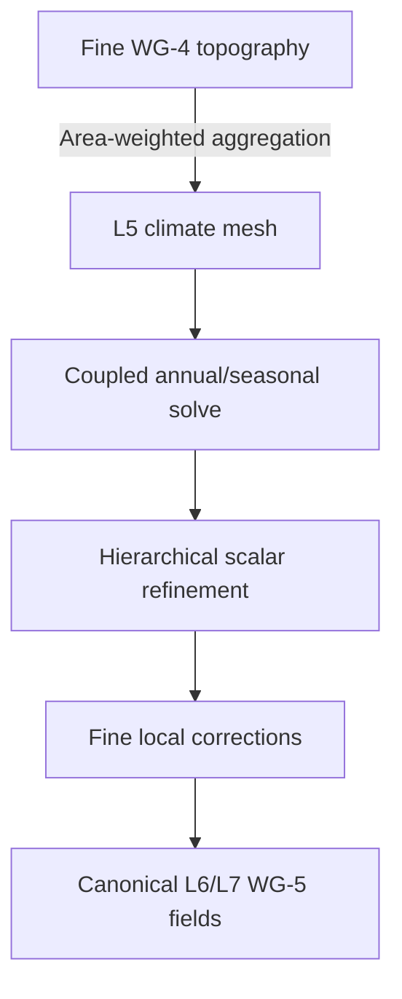

# WG-5 performance hardening

Stage `climate:coupled-surface@6` combines the accepted Stage-5 physical model with a multiresolution execution architecture. Broad atmospheric, ocean, and moisture state is solved on an area-aggregated climate mesh; deterministic hierarchy interpolation and fine-terrain corrections then reconstruct the canonical output level. WG-6 hydrology remains out of scope.

## Architecture

The default `ClimateParameters::maximum_global_climate_level` is L5. Requests at L5 or below execute the accepted full-resolution solver directly. L6 and L7 requests use this pipeline:

Aggregation uses the deterministic nearest-coarse provenance map and dual-cell area weights. Land elevation and ocean depth are averaged within their own surface classes, and a coarse cell uses the class with the greater represented area. Continuous climate fields are refined through stable parent-edge interpolation. Fine topography then corrects the quantities for which local resolution matters.

The implicit atmospheric heat solver is iteration-based. One graph iteration spans about twice the physical distance after each one-level coarsening, so Stage 6 divides its iteration count by the linear mesh-spacing ratio. This preserves the reference solver's effective physical transport radius instead of over-smoothing a coarse mesh. The controlled L6 comparison reduced temperature RMSE from 6.8 K to 0.61 K and raised temperature correlation to 0.9995.

`ClimateMetrics` records `global_solver_level` and `global_solver_sample_count`; the output `sample_count` remains the canonical fine-grid count. The climate model parameter hash includes the maximum global climate level, and the Stage-6 climate hash includes the fine topography identity, solver resolution, coarse solution identity, and every reconstructed output field.

## Retained exact-semantics work

Before the architecture change, PR #15 reduced the controlled L6 reference solve from about 18.93 s to about 9.10 s while preserving the Stage-5 hash `d8129323cf26fd1f`. Retained changes include reusable phase/year and iterative-solver workspaces, cached moisture and scalar-gradient geometry, cached orbital/insolation geometry, precomputed circulation and bathymetric factors, and removal of duplicate moisture request arithmetic.

The full-resolution solver remains available to the benchmark example as a reference oracle. It is not the default L6/L7 production path.

## Measured result

Controlled seed `ci-wg5-performance`, coarse L4, fine L6, 16 plates, 24 phases:

| Metric | Full-resolution reference | Stage-6 multiresolution |
| --- | ---: | ---: |
| Global solver cells | 40,962 | 10,242 |
| Local release climate time, LTO disabled | 10.23 s | 1.55 s |
| Speedup | 1.0x | 6.6x |
| Mean temperature | 287.784 K | 287.661 K |
| Temperature RMSE / correlation | - | 0.609 K / 0.99950 |
| Mean precipitation | 1,018.889 mm/yr | 950.779 mm/yr |
| Mean land precipitation | 931.450 mm/yr | 845.572 mm/yr |
| Mean land PET | 1,059.133 mm/yr | 1,037.057 mm/yr |
| Tropical rain-centroid excursion | 3.093 degrees | 3.133 degrees |
| Moisture budget relative error | `1.77e-14` | `1.01e-14` |

The controlled L7 performance case completes WG-5 in about 2.10 s locally, including reconstruction of 163,842 output cells. The permanent fixed-ancestry L6/L7 hydroclimate gate passes with 7.22% land-precipitation drift and 8.33% land-PET drift.

Wall-clock numbers depend on hardware and build configuration. Compare reference and candidate in the same process and build profile.

## Reproduction

Use `scripts/benchmark-wg5-performance.sh` for normal Stage-6 runs:

- `l4`: coarse L3 to fine L4, 12 plates;
- `l6`: coarse L4 to fine L6, 16 plates;
- `l7`: coarse L5 to fine L7, 24 plates;
- `suite`: all three.

Set `RUNS=N` for repeated climate-only timing. The benchmark example also accepts `--compare-reference` and `--climate-level N`; the former runs the full-resolution oracle before the candidate and reports field errors, correlations, hydroclimate percentiles, and tropical precipitation migration.

## Acceptance

- deterministic same-seed output and explicit Stage-6 identity;
- global moisture conservation below `1e-10` relative error;
- full L6/L7 output alignment and browser/WASM parity;
- fixed-ancestry L6/L7 hydroclimate quality gate;
- no regression in tropical precipitation migration;
- no WG-6 hydrology, GPU dependency, or unsupported timing claim.

Reducing orbital phases, loosening convergence, and the atmospheric relative-residual early exit remain rejected. Their speed/quality tradeoffs were inferior to deleting global work through multiresolution.
